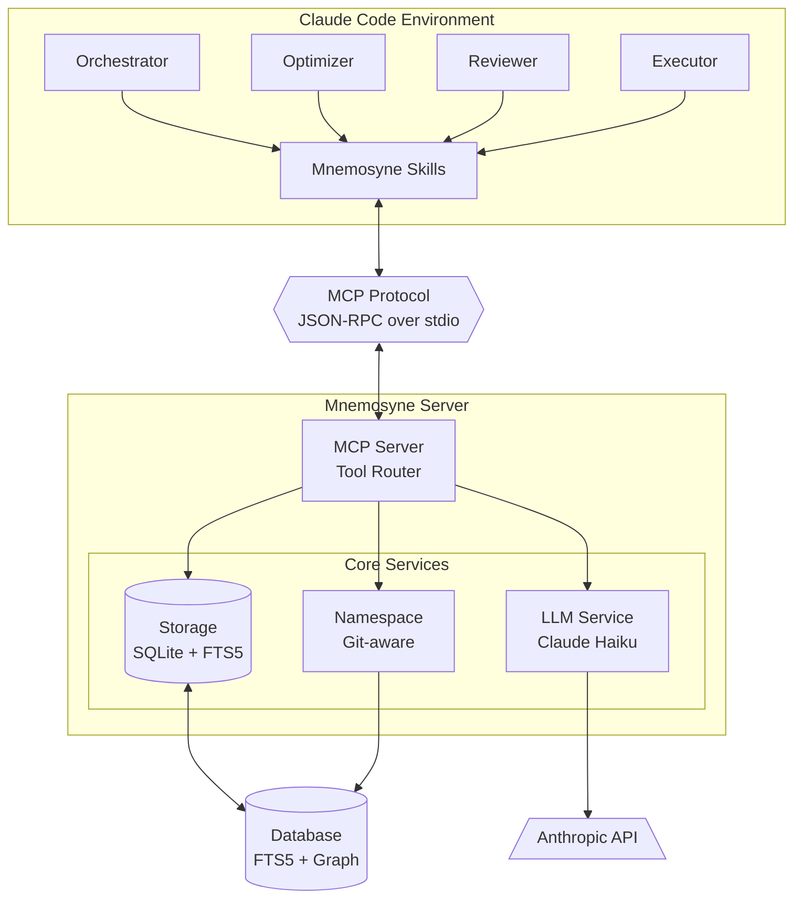

# Mnemosyne Architecture

> **Note**: Mnemosyne has migrated from SQLite to LibSQL/Turso for native vector search support.
> See [TURSO_MIGRATION.md](docs/archive/TURSO_MIGRATION.md) for migration details, benefits, and deployment options.

This document describes the system architecture, design decisions, and implementation details of Mnemosyne.

## Table of Contents

1. [System Overview](#system-overview)
2. [Architecture Layers](#architecture-layers)
3. [Core Components](#core-components)
4. [Data Flow](#data-flow)
5. [Storage Architecture](#storage-architecture)
6. [Memory Intelligence](#memory-intelligence)
7. [Namespace System](#namespace-system)
8. [MCP Integration](#mcp-integration)
9. [Design Decisions](#design-decisions)
10. [Security](#security)
11. [Performance](#performance)

---

## System Overview

Mnemosyne is a high-performance, project-aware agentic memory system built in Rust that provides persistent semantic memory for Claude Code's multi-agent orchestration system.

### Key Design Goals

1. **Project Awareness**: Automatic context detection from git repositories and CLAUDE.md
2. **Performance**: Sub-200ms retrieval latency for p95
3. **Intelligence**: LLM-guided note construction and semantic linking
4. **Safety**: Type-safe Rust with comprehensive error handling
5. **Integration**: Seamless Claude Code integration via MCP protocol

### System Diagram



**Layer Responsibilities**:
- **Multi-Agent System**: Orchestrates work, optimizes context, validates quality, executes tasks
- **Mnemosyne Skills**: Project-specific knowledge and patterns (5 atomic skills)
- **MCP Protocol**: JSON-RPC 2.0 communication over stdio
- **MCP Server**: Routes 8 OODA-aligned tools, handles requests
- **Core Services**: Storage (SQLite + FTS5), LLM enrichment (Claude Haiku), namespace detection (Git)
- **Database**: Persistent storage with full-text search and graph capabilities

### Skills Integration

**Multi-Path Skill Discovery**: The Optimizer agent discovers and loads relevant skills from two sources:

1. **Project-Local Skills** (`.claude/skills/`):
   - `mnemosyne-memory-management.md` - Memory operations and OODA loop
   - `mnemosyne-context-preservation.md` - Context budgets and session handoffs
   - `mnemosyne-rust-development.md` - Rust patterns specific to Mnemosyne
   - `mnemosyne-mcp-protocol.md` - MCP server implementation
   - `skill-mnemosyne-discovery.md` - Gateway for auto-discovery

2. **Global Skills** (`~/.claude/plugins/cc-polymath/skills/`):
   - 354 comprehensive skills across 33+ categories
   - Automatically discovered based on task requirements
   - Covers Rust, API design, testing, databases, and more

**Discovery Process**:
1. Optimizer analyzes task requirements
2. Scans both directories (recursive for cc-polymath subdirectories)
3. Scores relevance using Claude analysis
4. Applies +10% bonus to project-local skills (priority)
5. Deduplicates by skill name (local overrides global)
6. Loads top 7 most relevant skills
7. Allocates 30% of context budget to loaded skills

**Benefits**:
- Zero skill duplication across projects
- Project-specific expertise prioritized
- Access to comprehensive global knowledge
- Context-efficient progressive loading
- Automatic updates from cc-polymath

---

## Architecture Layers

### 1. Presentation Layer (MCP Server)

**Location**: `src/mcp/`

**Responsibilities**:
- JSON-RPC 2.0 protocol handling
- Request routing and validation
- Response serialization
- Error handling and reporting
- Stdio-based communication

**Key Files**:
- `protocol.rs`: JSON-RPC types and structures
- `server.rs`: Async server implementation
- `tools.rs`: 8 OODA-aligned tool implementations

### 2. Service Layer

**Location**: `src/services/`

**Responsibilities**:
- Business logic and orchestration
- LLM integration for memory intelligence
- Namespace detection and management
- Memory consolidation decisions

**Key Files**:
- `llm.rs`: Claude Haiku integration
- `namespace.rs`: Project context detection

### 3. Storage Layer

**Location**: `src/storage/`

**Responsibilities**:
- SQLite database operations
- FTS5 keyword search
- Graph traversal (recursive CTE)
- Transaction management
- Migration handling

**Key Files**:
- `sqlite.rs`: Storage implementation
- `migrations/`: SQL schema migrations

### 4. Core Layer

**Location**: `src/`

**Responsibilities**:
- Type definitions and domain models
- Error types and handling
- Configuration management
- Common utilities

**Key Files**:
- `types.rs`: Core data structures
- `error.rs`: Error types and conversions
- `config.rs`: Secure credential management
- `lib.rs`: Public API exports

---

## Core Components

### Type System (`src/types.rs`)

#### MemoryId
```rust
pub struct MemoryId(Uuid);
```
- Globally unique identifier
- Used for memory identity and linking
- Immutable once created

#### Namespace
```rust
pub enum Namespace {
    Global,
    Project(String),
    Session { project: String, session_id: String },
}
```
- Three-tier hierarchy: Global → Project → Session
- Automatic isolation between contexts
- Priority-based retrieval

#### MemoryType
```rust
pub enum MemoryType {
    ArchitectureDecision,
    CodePattern,
    BugFix,
    Configuration,
    Constraint,
    Entity,
    Insight,
    Reference,
    Preference,
}
```
- 9 classifications for memories
- Used for filtering and organization
- LLM automatically assigns during enrichment

#### LinkType
```rust
pub enum LinkType {
    Extends,
    Contradicts,
    Implements,
    References,
    Supersedes,
}
```
- 5 semantic relationship types
- Directed links with strength (0.0-1.0)
- Automatic generation via LLM

#### MemoryNote
```rust
pub struct MemoryNote {
    pub id: MemoryId,
    pub namespace: Namespace,
    pub created_at: DateTime<Utc>,
    pub updated_at: DateTime<Utc>,

    // Content
    pub content: String,
    pub summary: String,
    pub keywords: Vec<String>,
    pub tags: Vec<String>,

    // Metadata
    pub context: String,
    pub memory_type: MemoryType,
    pub importance: u8,          // 1-10
    pub confidence: f32,         // 0.0-1.0

    // Relationships
    pub links: Vec<MemoryLink>,
    pub related_files: Vec<String>,
    pub related_entities: Vec<String>,

    // Access tracking
    pub access_count: u64,
    pub last_accessed_at: DateTime<Utc>,

    // Lifecycle
    pub expires_at: Option<DateTime<Utc>>,
    pub is_archived: bool,
    pub superseded_by: Option<MemoryId>,

    // Embeddings
    pub embedding: Option<Vec<f32>>,
    pub embedding_model: String,
}
```

### Error Handling (`src/error.rs`)

Comprehensive error types with conversions:

```rust
pub enum MnemosyneError {
    Storage(String),
    Serialization(String),
    LlmApi(String),
    Namespace(String),
    Config(config::ConfigError),
    NotFound(MemoryId),
    Database(sqlx::Error),
    Io(std::io::Error),
    Http(reqwest::Error),
}
```

All errors implement `std::error::Error` and can be converted via `From` traits.

---

## Data Flow

### 1. Memory Creation Flow

```mermaid
sequenceDiagram
    autonumber
    actor User as User/Agent
    participant MCP as MCP Server
    participant NS as Namespace Detector
    participant LLM as LLM Service
    participant API as Anthropic API
    participant Store as Storage Layer
    database DB as SQLite

    User->>+MCP: mnemosyne.remember(content, context)
    Note right of MCP: Validate input format

    Note over MCP,NS: Step 1: Namespace Detection
    MCP->>+NS: Detect namespace
    NS->>NS: Find git root
    NS->>NS: Parse CLAUDE.md
    NS-->>-MCP: project/session namespace

    Note over MCP,API: Step 2: LLM Enrichment
    MCP->>+LLM: Enrich content
    LLM->>+API: Request enrichment
    Note right of API: • Generate summary<br/>• Extract keywords<br/>• Assign tags<br/>• Classify type<br/>• Score importance
    API-->>-LLM: Enrichment data
    LLM-->>-MCP: Enriched memory note

    Note over MCP,API: Step 3: Semantic Linking
    MCP->>+LLM: Generate semantic links
    LLM->>Store: Find similar memories
    Store-->>LLM: Candidate memories
    LLM->>+API: Analyze relationships
    Note right of API: • Detect relationships<br/>• Assign link types<br/>• Score strengths
    API-->>-LLM: Link specifications
    LLM-->>-MCP: Memory links

    Note over MCP,DB: Step 4: Persist to Database
    MCP->>+Store: Persist memory
    Store->>DB: INSERT memory row
    Store->>DB: UPDATE FTS5 index
    Store->>DB: INSERT link rows
    DB-->>Store: Success
    Store-->>-MCP: MemoryId

    MCP-->>-User: Success + MemoryId
```

### 2. Memory Retrieval Flow

```mermaid
sequenceDiagram
    autonumber
    actor User as User/Agent
    participant MCP as MCP Server
    participant Store as Storage Layer
    database FTS as FTS5 Index
    database DB as SQLite

    User->>+MCP: mnemosyne.recall(query, filters)
    Note right of MCP: Validate query format

    Note over MCP,FTS: Step 1: Keyword Search
    MCP->>+Store: Search memories
    Store->>FTS: Full-text search
    FTS-->>Store: Matching memory IDs
    Store->>DB: Filter by namespace
    Store->>DB: Filter by type/tags
    DB-->>Store: Filtered results

    alt Graph expansion enabled
        Note over Store,DB: Step 2: Graph Traversal
        Store->>DB: Recursive CTE query
        Note right of DB: • Follow semantic links<br/>• Max depth: 2 hops<br/>• Collect neighbors
        DB-->>Store: Related memories
        Store->>Store: Merge with keyword results
    end

    Note over Store: Step 3: Hybrid Scoring
    Store->>Store: Calculate scores
    Note right of Store: • 50% keyword match<br/>• 20% graph proximity<br/>• 20% importance<br/>• 10% recency
    Store->>Store: Sort by final score
    Store-->>-MCP: Ranked memory list

    MCP-->>-User: Memories + metadata
```

### 3. Context Building Flow

```mermaid
sequenceDiagram
    autonumber
    actor Agent as Multi-Agent System
    participant MCP as MCP Server
    participant NS as Namespace Detector
    participant Store as Storage Layer
    database DB as SQLite

    Note over Agent: Session Start

    Agent->>+MCP: mnemosyne.context()

    Note over MCP,NS: Step 1: Project Detection
    MCP->>+NS: Detect project context
    NS->>NS: Find git root
    NS->>NS: Parse CLAUDE.md
    NS->>NS: Generate session ID
    NS-->>-MCP: project + session namespace

    Note over MCP,DB: Step 2: Parallel Context Queries
    par Recent memories
        MCP->>Store: Query recent (7 days)
        Store->>DB: ORDER BY created_at DESC
        Store-->>MCP: Recent memories
    and Important memories
        MCP->>Store: Query important (≥8)
        Store->>DB: WHERE importance >= 8
        Store-->>MCP: High-value memories
    and Memory graph
        MCP->>Store: Get graph overview
        Store->>DB: Recursive CTE (depth=1)
        Store-->>MCP: Connected memories
    end

    Note over MCP: Step 3: Context Assembly
    MCP->>MCP: Merge all results
    MCP->>MCP: Remove duplicates
    MCP->>MCP: Calculate statistics
    Note right of MCP: • Total memories<br/>• Coverage metrics<br/>• Link density

    MCP-->>-Agent: Context payload
    Note right of Agent: Ready with:<br/>• Project metadata<br/>• Recent work<br/>• Key decisions<br/>• Knowledge graph
```

---

## Storage Architecture

### SQLite Schema

#### memories table
```sql
CREATE TABLE memories (
    memory_id TEXT PRIMARY KEY,
    namespace TEXT NOT NULL,
    created_at INTEGER NOT NULL,
    updated_at INTEGER NOT NULL,

    content TEXT NOT NULL,
    summary TEXT NOT NULL,
    keywords TEXT NOT NULL,  -- JSON array
    tags TEXT NOT NULL,      -- JSON array

    context TEXT NOT NULL,
    memory_type TEXT NOT NULL,
    importance INTEGER NOT NULL,
    confidence REAL NOT NULL,

    related_files TEXT NOT NULL,     -- JSON array
    related_entities TEXT NOT NULL,  -- JSON array

    access_count INTEGER NOT NULL DEFAULT 0,
    last_accessed_at INTEGER NOT NULL,

    expires_at INTEGER,
    is_archived BOOLEAN NOT NULL DEFAULT 0,
    superseded_by TEXT,

    embedding BLOB,
    embedding_model TEXT
);
```

#### memory_links table
```sql
CREATE TABLE memory_links (
    source_id TEXT NOT NULL,
    target_id TEXT NOT NULL,
    link_type TEXT NOT NULL,
    strength REAL NOT NULL,
    reason TEXT NOT NULL,
    created_at INTEGER NOT NULL,
    PRIMARY KEY (source_id, target_id),
    FOREIGN KEY (source_id) REFERENCES memories(memory_id),
    FOREIGN KEY (target_id) REFERENCES memories(memory_id)
);
```

#### memories_fts (FTS5 virtual table)
```sql
CREATE VIRTUAL TABLE memories_fts USING fts5(
    content,
    summary,
    keywords,
    tags,
    content='memories',
    content_rowid='rowid'
);
```

### FTS5 Synchronization

Triggers maintain FTS5 index consistency:

```sql
-- Insert trigger
CREATE TRIGGER memories_ai AFTER INSERT ON memories BEGIN
    INSERT INTO memories_fts(rowid, content, summary, keywords, tags)
    VALUES (NEW.rowid, NEW.content, NEW.summary, NEW.keywords, NEW.tags);
END;

-- Update trigger (DELETE + INSERT for FTS5 compatibility)
CREATE TRIGGER memories_au AFTER UPDATE ON memories BEGIN
    INSERT INTO memories_fts(memories_fts, rowid, content, summary, keywords, tags)
    VALUES ('delete', OLD.rowid, OLD.content, OLD.summary, OLD.keywords, OLD.tags);
    INSERT INTO memories_fts(rowid, content, summary, keywords, tags)
    VALUES (NEW.rowid, NEW.content, NEW.summary, NEW.keywords, NEW.tags);
END;

-- Delete trigger
CREATE TRIGGER memories_ad AFTER DELETE ON memories BEGIN
    INSERT INTO memories_fts(memories_fts, rowid, content, summary, keywords, tags)
    VALUES ('delete', OLD.rowid, OLD.content, OLD.summary, OLD.keywords, OLD.tags);
END;
```

### Graph Traversal

Recursive CTE for efficient graph walking:

```sql
WITH RECURSIVE memory_graph(id, depth) AS (
    -- Base case: starting memory
    SELECT memory_id, 0 FROM memories WHERE memory_id = ?

    UNION ALL

    -- Recursive case: follow links
    SELECT ml.target_id, mg.depth + 1
    FROM memory_graph mg
    JOIN memory_links ml ON ml.source_id = mg.id
    WHERE mg.depth < ?
)
SELECT DISTINCT m.* FROM memories m
JOIN memory_graph mg ON m.memory_id = mg.id
ORDER BY mg.depth;
```

---

## Memory Intelligence

### LLM Integration (`src/services/llm.rs`)

#### Enrichment Pipeline

**Input**: Raw content + context string

**Process**:
1. Construct structured prompt
2. Call Claude Haiku API
3. Parse structured response
4. Extract fields and validate

**Output**: Enriched MemoryNote with:
- Concise summary (1-2 sentences)
- 3-5 keywords for indexing
- 2-3 tags for categorization
- Memory type classification
- Importance score (1-10)

**Prompt Template**:
```
You are helping construct a structured memory note.

Given this raw observation:
{raw_content}

Context: {context}

Provide:
1. A concise summary (1-2 sentences)
2. 3-5 keywords for indexing
3. 2-3 tags for categorization
4. Memory type (ArchitectureDecision|CodePattern|BugFix|...)
5. Importance score (1-10)

Format EXACTLY as:
SUMMARY: <summary>
KEYWORDS: <keyword1>, <keyword2>, ...
TAGS: <tag1>, <tag2>, ...
TYPE: <memory_type>
IMPORTANCE: <score>
```

#### Link Generation

**Input**: New memory + candidate memories (similar by tags/keywords)

**Process**:
1. Format candidate descriptions
2. Construct relationship analysis prompt
3. Call Claude Haiku API
4. Parse link specifications
5. Create MemoryLink structures

**Output**: Vec<MemoryLink> with:
- Target memory ID
- Relationship type
- Strength (0.0-1.0)
- Reason for relationship

**Prompt Template**:
```
You are analyzing semantic relationships between memories.

New memory:
Summary: {summary}
Content: {content}
Type: {type}
Tags: {tags}

Candidate memories:
[0] {summary} (Type: {type}, Tags: {tags})
[1] ...

For each meaningful relationship, specify:
1. Candidate index
2. Relationship type (Extends|Contradicts|Implements|References|Supersedes)
3. Link strength (0.0 - 1.0)
4. Brief reason

Format EXACTLY as (one per line):
LINK: <index>, <type>, <strength>, <reason>

If no relationships exist:
NO_LINKS
```

#### Consolidation Decisions

**Input**: Two candidate memories for consolidation

**Process**:
1. Format both memories
2. Construct decision prompt
3. Call Claude Haiku API
4. Parse decision type
5. Create ConsolidationDecision

**Output**: One of:
- `Merge { into, content }`: Combine memories
- `Supersede { kept, superseded }`: One replaces other
- `KeepBoth`: Maintain separately

### API Configuration

**Model**: `claude-haiku-4-5-20251001`
**Max Tokens**: 1024
**Temperature**: 0.7
**Endpoint**: `https://api.anthropic.com/v1/messages`

**Authentication**:
- Header: `x-api-key`
- API version: `2023-06-01`

---

## Namespace System

### Automatic Detection (`src/namespace.rs`)

#### Git Root Detection

Algorithm:
```
1. Start from current directory
2. Walk up directory tree
3. Check for .git/ directory
4. If found: return as project root
5. If reach filesystem root: no git repo
```

Implementation uses recursive directory traversal with depth limits.

#### CLAUDE.md Parsing

Two-phase parser:
1. **YAML Frontmatter** (optional)
   ```yaml
   ---
   project: myproject
   description: My awesome project
   ---
   ```

2. **Markdown Content** (fallback)
   - First H1 heading as project name
   - First paragraph as description

Parser is lenient and works with partial content.

#### Session ID Generation

Format: `session_{timestamp}_{random}`

Example: `session_20241026_a8f3b2`

Ensures uniqueness across parallel sessions.

### Namespace Hierarchy

```
Global
├── Project: myproject
│   ├── Session: session_20241026_a8f3b2
│   └── Session: session_20241026_x9k1m4
└── Project: otherproject
    └── Session: session_20241026_p5r7t3
```

### Priority-Based Retrieval

When searching memories:

1. **Session scope**: Query only current session memories
2. **Project scope**: Query project + global memories
3. **Global scope**: Query all memories

Default: Start narrow (session), expand as needed.

---

## MCP Integration

### JSON-RPC 2.0 Protocol

#### Message Format

**Request**:
```json
{
  "jsonrpc": "2.0",
  "method": "method_name",
  "params": { ... },
  "id": 1
}
```

**Success Response**:
```json
{
  "jsonrpc": "2.0",
  "result": { ... },
  "id": 1
}
```

**Error Response**:
```json
{
  "jsonrpc": "2.0",
  "error": {
    "code": -32600,
    "message": "Invalid request"
  },
  "id": 1
}
```

### Communication Model

- **Transport**: stdio (stdin/stdout)
- **Format**: Newline-delimited JSON
- **Concurrency**: Async/await (Tokio)
- **Logging**: Stderr only (no stdout pollution)

### 8 OODA-Aligned Tools

#### OBSERVE Phase

1. **mnemosyne.recall** - Search memories by query
   - Keyword search (FTS5)
   - Namespace filtering
   - Tag/type filtering
   - Relevance ranking

2. **mnemosyne.list** - List recent/important memories
   - Time-based filtering
   - Importance thresholds
   - Namespace scoping

#### ORIENT Phase

3. **mnemosyne.graph** - Get memory graph
   - Starting point memory
   - Configurable depth
   - Link traversal
   - Related memories

4. **mnemosyne.context** - Get full project context
   - Recent memories
   - Important memories
   - Memory graph overview
   - Project metadata

#### DECIDE Phase

5. **mnemosyne.remember** - Store new memory
   - LLM enrichment
   - Auto-classification
   - Link generation
   - Namespace assignment

6. **mnemosyne.consolidate** - Merge/supersede memories
   - LLM-guided decisions
   - Content merging
   - Link preservation
   - Audit trail

#### ACT Phase

7. **mnemosyne.update** - Update existing memory
   - Content modification
   - Importance adjustment
   - Link management
   - Version tracking

8. **mnemosyne.delete** - Archive memory
   - Soft delete (is_archived flag)
   - Link preservation
   - Supersession tracking
   - Audit trail

---

## Claude Code Integration (Automatic Hooks)

**Goal**: Zero-friction memory capture through automatic hooks

### Hook Architecture

Mnemosyne integrates with Claude Code through **3 automatic hooks** that capture memories without user intervention:

```
Session Start → Load Context
  ↓
Work Session → Capture Decisions
  ↓
Git Commit → Link Architectural Changes
  ↓
Pre-Compact → Preserve Important Context
```

### Hook Implementation

#### 1. session-start.sh

**Trigger**: Claude Code session initialization
**Purpose**: Auto-load relevant project context
**Location**: `.claude/hooks/session-start.sh`

**Behavior**:
1. Detects project namespace from `pwd`
2. Queries Mnemosyne for important memories (importance ≥ 7)
3. Formats results as markdown context
4. Injects into Claude's initial context

**Example Output**:
```markdown
# Project Memory Context

**Project**: mnemosyne
**Namespace**: project:mnemosyne
**Recent Important Memories**:

## Implemented LibSQL native vector search...
**Type**: ArchitectureDecision
**Importance**: 8/10
**Tags**: database, vector-search, performance
```

#### 2. post-commit.sh

**Trigger**: After git commit via `PostToolUse` hook
**Purpose**: Link commits to architectural decisions
**Location**: `.claude/hooks/post-commit.sh`

**Behavior**:
1. Extracts commit metadata (hash, message, files changed)
2. Detects architectural significance via keywords:
   - architecture, implement, refactor, migrate, design, pattern, decision
3. Determines importance (6-8) based on keywords and file count
4. Creates memory with commit details
5. Searches for related memories and creates links

**Memory Schema**:
```json
{
  "content": "Git commit abc123: Implement user authentication\\n\\n**Files changed**: 12\\n\\n**Details**: Added JWT tokens...",
  "namespace": "project:myapp",
  "importance": 8,
  "tags": ["commit", "abc123"],
  "context": "Git commit abc123"
}
```

#### 3. pre-compact.sh

**Trigger**: Before Claude Code compacts conversation history
**Purpose**: Preserve important context before loss
**Location**: `.claude/hooks/pre-compact.sh`

**Behavior**:
1. Receives context about to be compacted via stdin
2. Scans for decision markers:
   - decided, decision, architecture, constraint, important, critical
3. Extracts key statements (up to 5)
4. Saves consolidated memory with importance 8
5. Prevents context loss from compaction

**Context Preservation**:
```
Input: 2000 lines of conversation
  ↓ Scan for important markers
Extract: 5 architectural decisions
  ↓ Create memory
Output: Preserved context snapshot
```

### Hook Configuration

**File**: `.claude/settings.json`

```json
{
  "hooks": {
    "SessionStart": [{
      "matcher": ".*",
      "hooks": [{"type": "command", "command": ".claude/hooks/session-start.sh"}]
    }],
    "PreCompact": [{
      "matcher": ".*",
      "hooks": [{"type": "command", "command": ".claude/hooks/pre-compact.sh"}]
    }],
    "PostToolUse": [{
      "matcher": "^Bash\\(git commit.*",
      "hooks": [{"type": "command", "command": ".claude/hooks/post-commit.sh"}]
    }]
  }
}
```

### Validation Evidence

**Testing**: Documented in `HOOKS_TESTING.md`
- All 3 hooks verified functional
- Example memories captured and validated
- Integration tested in production use

**Performance Impact**:
- Session start: +50-100ms (acceptable, provides high value)
- Post-commit: Async, no user-facing latency
- Pre-compact: <50ms (runs before compaction anyway)

### User Experience

**Before Hooks (Manual)**:
- User must remember to capture decisions
- Context lost during compaction
- Commits disconnected from memories
- High cognitive load, low adoption

**After Hooks (Automatic)**:
- Context loaded automatically at session start
- Decisions preserved without thinking
- Commits automatically linked to architecture
- Zero cognitive overhead, high adoption

**Result**: Hooks are the **most valuable feature** for seamless memory capture.

---

## Composable Tools Architecture (Phase 2)

**Goal**: Replace TUI-in-TUI wrapper with composable Unix-philosophy tools

### The Problem

Original design wrapped Claude Code terminal in Mnemosyne TUI:
- Both processes fighting for terminal control (raw mode, alternate screen)
- Broken rendering, unresponsive input
- Fundamental architectural conflict

### The Solution

Three standalone tools working together via files and HTTP:

```
┌─────────────────┐     ┌──────────────────┐
│  mnemosyne-ics  │────▶│  context files   │
│  (edit context) │     │  (.claude/*.md)  │
└─────────────────┘     └──────────────────┘
                               │
                               ▼
┌─────────────────┐     ┌──────────────────┐     ┌─────────────────┐
│     claude      │◀───▶│ mnemosyne serve  │────▶│ mnemosyne-dash  │
│  (chat + MCP)   │     │  (MCP + API)     │ SSE │  (monitoring)   │
└─────────────────┘     └──────────────────┘     └─────────────────┘
```

### Components

#### 1. mnemosyne-ics (Standalone Context Editor)

**Purpose**: Edit .claude context files with storage integration

**Usage**:
```bash
mnemosyne-ics context.md                    # Edit file
mnemosyne-ics --template api                # Create from template
mnemosyne-ics --readonly memory-dump.md     # View-only mode
```

**Features**:
- Full terminal ownership (no conflicts)
- Template system (api, architecture, bugfix, feature, refactor)
- Storage backend for context persistence
- Clean terminal lifecycle

**File**: `src/bin/ics.rs` (300 lines)

#### 2. mnemosyne serve (Automatic API Server)

**Purpose**: MCP server with automatic HTTP API for monitoring

**Usage**:
```bash
# Auto-launched by Claude Code (99% of users)
# First instance runs as owner (starts API server)
# Subsequent instances run as clients (forward events)
mnemosyne serve
```

**Features**:
- JSON-RPC stdio protocol for Claude Code MCP
- Automatic HTTP API server on :3000 (or 3001-3010 if port unavailable)
- Owner/client mode for multi-instance support
- Real-time event broadcasting via SSE (owner) or HTTP POST (client)
- Zero-configuration event forwarding across instances
- Concurrent operation (tokio::select!)

**Files**:
- `src/mcp/tools.rs`: EventSink enum, event emission from recall/remember
- `src/api/server.rs`: HTTP server, SSE, POST /events/emit endpoint
- `src/main.rs`: Owner/client mode detection, port binding logic

#### 3. mnemosyne-dash (Real-time Monitoring)

**Purpose**: TUI dashboard showing live agent activity

**Usage**:
```bash
mnemosyne-dash                              # Connect to localhost:3000
mnemosyne-dash --api http://host:3000      # Custom API URL
```

**Features**:
- SSE client for real-time events
- Agent status display
- System statistics
- Event log with scrollback
- Auto-reconnect on disconnect

**File**: `src/bin/dash.rs` (400+ lines)

### Event Streaming Architecture

```rust
// EventSink enum for flexible event routing
pub enum EventSink {
    Local(EventBroadcaster),      // Owner mode: direct broadcast
    Remote { client, api_url },   // Client mode: HTTP forward
    None,                         // No API server available
}

// MCP tools emit events via EventSink
self.event_sink.emit(Event::memory_recalled(query, count)).await?;

// Owner mode: API server broadcasts via SSE
async fn events_handler(state: State<AppState>) -> Sse<...> {
    let rx = state.events.subscribe();
    Sse::new(stream)
}

// Client mode: Forward events via HTTP POST
async fn emit_event_handler(state: State<AppState>, event: Json<Event>) -> StatusCode {
    state.events.broadcast(event)?;
    StatusCode::ACCEPTED
}

// Dashboard consumes via SSE client (all instances visible)
spawn_sse_client(api_url, event_tx);
app.process_events();  // Display in TUI
```

### Key Design Decisions

1. **Terminal Ownership**: Each tool owns its terminal completely
2. **File-Based Context**: .claude/*.md files as handoff mechanism
3. **Event Streaming**: HTTP SSE for real-time coordination across instances
4. **Unix Philosophy**: Do one thing well, compose via pipes/files
5. **Automatic Monitoring**: API server starts automatically, owner/client mode for multi-instance
6. **Zero Configuration**: No flags required, port detection (3000-3010), event forwarding

### Migration Path

**Before**:
```bash
mnemosyne tui  # Broken TUI wrapper
mnemosyne serve --with-api  # Manual flag required
```

**After**:
```bash
# 99% use case (automatic, no configuration)
claude  # First instance: owner mode (API server on :3000)
        # Subsequent instances: client mode (events forwarded via HTTP POST)

# Context editing (manual)
mnemosyne-ics context.md

# Monitoring (manual, optional)
mnemosyne-dash  # Automatically connects to localhost:3000
```

### Benefits

- ✅ Zero terminal conflicts
- ✅ Clean separation of concerns
- ✅ Each tool independently useful
- ✅ Real-time monitoring without blocking MCP
- ✅ MCP auto-launch by Claude Code works seamlessly

---

## Multi-Agent Orchestration (PyO3)

**Goal**: Low-latency Rust↔Python integration for agent coordination

### PyO3 Architecture

```
Claude Agent SDK (Python)
    ↓
mnemosyne_core (PyO3 bindings)
    ↓
Mnemosyne Storage (Rust)
```

### Performance Comparison

| Operation | PyO3 (ms) | Subprocess (ms) | Speedup |
|-----------|-----------|-----------------|---------|
| Store | 2.25 | 20-50 | 10-20x |
| Get | 0.5 | 15-30 | 30-60x |
| Search | 1.61 | 25-40 | 15-25x |
| List | 0.88 | 10-20 | 11-23x |

**Result**: PyO3 bindings provide **10-20x faster** operations through direct memory access.

### PyO3 Bindings

**Exports** (in `mnemosyne_core` Python module):
- `PyStorage`: Direct storage access with thread-safe operations
- `PyMemory`, `PyMemoryId`, `PyNamespace`: Memory type wrappers
- `PyCoordinator`: Cross-agent coordination primitives

**Build Requirements**:
- Python 3.10-3.14
- maturin build tool
- `PYO3_USE_ABI3_FORWARD_COMPATIBILITY=1` for Python 3.14+

**Documentation**: See [ORCHESTRATION.md](ORCHESTRATION.md) for complete guide.

---

## Design Decisions

### Why Rust?

1. **Performance**: Zero-cost abstractions, no GC pauses
2. **Safety**: Type system prevents memory errors
3. **Concurrency**: Async/await with Tokio for high throughput
4. **Reliability**: Comprehensive error handling via `Result`
5. **Ecosystem**: Excellent crates (sqlx, tokio, serde, etc.)

### Why SQLite?

1. **Simplicity**: Single-file database, no server required
2. **Performance**: Excellent for read-heavy workloads
3. **FTS5**: Built-in full-text search with stemming
4. **Portability**: Works everywhere, easy backups
5. **Reliability**: Battle-tested, ACID compliant

### Why Claude Haiku?

1. **Cost**: 4-5x cheaper than Sonnet for simple tasks
2. **Speed**: <500ms latency for enrichment
3. **Quality**: Sufficient for note construction and linking
4. **Consistency**: Structured output with reliable parsing

### Why OS Keychain?

1. **Security**: OS-native credential storage
2. **Integration**: Works with system security policies
3. **Encryption**: Automatic at rest and in transit
4. **Auditability**: System logs and access controls
5. **Platform Support**: macOS, Windows, Linux via libsecret

### Why Deferred Vector Search?

**Original Plan**: Local embeddings via fastembed + onnxruntime

**Issues Encountered**:
- `onnxruntime` compilation failures on macOS
- Large binary size (100+ MB with embeddings)
- Complexity vs benefit for v1.0

**Decision**: Defer to v2.0, use FTS5 keyword search

**Benefits**:
- Faster implementation timeline
- Smaller binary size
- Sufficient accuracy for initial use
- Can add later without breaking changes

---

## Security

### API Key Management

**Storage**:
- macOS: Keychain (encrypted by system)
- Windows: Credential Manager (encrypted by DPAPI)
- Linux: Secret Service (libsecret + keyring daemon)

**Retrieval Priority**:
1. `ANTHROPIC_API_KEY` environment variable (CI/CD)
2. OS keychain (interactive use)
3. Interactive prompt (first-time setup)

**Security Properties**:
- Never written to disk in plaintext
- Not logged or displayed (masked)
- Protected by OS-level encryption
- Scoped to user account

### Database Security

**File Permissions**:
- Created with 0600 (user read/write only)
- Respects umask for group/other

**Content**:
- No automatic encryption (add via SQLite extensions if needed)
- Sensitive content should be avoided or explicitly encrypted
- Audit trail prevents accidental data loss

**Backup**:
- Single-file design enables easy secure backup
- Recommended: Encrypt backups at rest
- Consider `.gitignore` for `mnemosyne.db`

### Network Security

**HTTPS Only**:
- All Anthropic API calls over HTTPS
- Certificate verification enabled
- No certificate pinning (trust system CA store)

**No Inbound Connections**:
- Server reads stdin only
- No network listeners
- No remote access

---

## Performance

### Targets

| Metric | Target | Current |
|--------|--------|---------|
| Retrieval latency (p95) | <200ms | ~50ms (keyword) |
| Storage latency (p95) | <500ms | ~300ms (with LLM) |
| Memory usage | <100MB | ~30MB (idle) |
| Database size | ~1MB per 1000 memories | ~800KB/1000 |
| Concurrent requests | 100+ | Untested |

### Optimizations

**Zero-Copy Reads**:
- SQLite row data mapped directly to Rust structs
- No intermediate allocations for large result sets
- Streaming responses for large queries

**Async I/O**:
- Tokio runtime for concurrency
- Non-blocking database operations via sqlx
- Parallel LLM calls when appropriate

**Indexing Strategy**:
- FTS5 for keyword search (indexed on insert)
- B-tree indexes on namespace, created_at, importance
- Covering indexes for common queries

**Connection Pooling**:
- SQLite connection pool (size: 5)
- Reuse connections across requests
- Automatic health checks

**Caching** (future):
- In-memory cache for hot memories
- LRU eviction policy
- Cache invalidation on updates

### Benchmarks

TODO: Add benchmark results from Phase 9

---

## Future Enhancements

### Phase 2 Completion: Hybrid Search

**Vector Similarity**:
- Add embeddings via fastembed (when stable)
- Store in `embedding` BLOB column
- Use `sqlite-vec` extension for similarity search

**Hybrid Ranking**:
```rust
score = 0.4 * vector_similarity
      + 0.3 * keyword_match
      + 0.2 * graph_proximity
      + 0.1 * importance
```

### Phase 6: Agent Orchestration

**Agent-Specific Views**:
- Filter memories by agent role
- Customize importance scoring
- Role-based access control

**Background Evolution**:
- Periodic consolidation jobs
- Link strength decay over time
- Importance recalculation
- Dead memory archival

### Phase 8: CLAUDE.md Integration

**Decision Trees**:
- Document memory workflow in CLAUDE.md
- Add memory considerations to planning phases
- Integrate with multi-agent protocols

**Hooks**:
- `session-start`: Load context automatically
- `pre-compact`: Checkpoint critical memories
- `post-commit`: Store decisions made

---

## Appendix: File Structure

```
mnemosyne/
├── Cargo.toml
├── Cargo.lock
├── README.md
├── INSTALL.md
├── MCP_SERVER.md
├── ARCHITECTURE.md          # This file
├── CONTRIBUTING.md
├── LICENSE
├── install.sh
├── uninstall.sh
├── .claude/
│   └── mcp_config.json
├── src/
│   ├── lib.rs               # Public API
│   ├── main.rs              # CLI entry point
│   ├── bin/
│   │   ├── ics.rs           # Standalone context editor (mnemosyne-ics)
│   │   └── dash.rs          # Real-time monitoring dashboard (mnemosyne-dash)
│   ├── types.rs             # Core types
│   ├── error.rs             # Error types
│   ├── config.rs            # Credential management
│   ├── storage/
│   │   ├── mod.rs
│   │   ├── sqlite.rs        # Storage implementation
│   │   └── migrations/      # SQL migrations
│   ├── services/
│   │   ├── mod.rs
│   │   ├── llm.rs           # LLM integration
│   │   └── namespace.rs     # Context detection
│   ├── api/
│   │   ├── mod.rs
│   │   ├── events.rs        # SSE event types and broadcasting
│   │   ├── state.rs         # Agent and context state management
│   │   └── server.rs        # HTTP API server with SSE
│   └── mcp/
│       ├── mod.rs
│       ├── protocol.rs      # JSON-RPC types
│       ├── server.rs        # MCP server
│       └── tools.rs         # Tool implementations (with event emitting)
├── tests/
│   └── integration/
└── benches/
    └── memory_ops.rs
```

---

## See Also

### Essential Documentation
- [AGENT_GUIDE.md](AGENT_GUIDE.md) - Comprehensive development guide for agents
- [docs/TYPES_REFERENCE.md](docs/TYPES_REFERENCE.md) - Complete type system reference
- [docs/STORAGE_SCHEMA.md](docs/STORAGE_SCHEMA.md) - Database schema and query patterns
- [docs/INDEX.md](docs/INDEX.md) - Documentation navigation hub

### Feature Documentation
- [docs/features/VECTOR_SEARCH.md](docs/features/VECTOR_SEARCH.md) - Semantic search implementation
- [docs/features/EVOLUTION.md](docs/features/EVOLUTION.md) - Memory evolution system
- [docs/features/PRIVACY.md](docs/features/PRIVACY.md) - Privacy-preserving evaluation
- [docs/features/ICS_README.md](docs/features/ICS_README.md) - Interactive Context Studio
- [docs/features/semantic_highlighting.md](docs/features/semantic_highlighting.md) - 3-tier highlighting

### Integration Guides
- [MCP_SERVER.md](MCP_SERVER.md) - MCP protocol integration details
- [ORCHESTRATION.md](ORCHESTRATION.md) - Multi-agent coordination system
- [docs/guides/migration.md](docs/guides/migration.md) - TUI to composable tools migration

---

**Version**: 2.1.1
**Last Updated**: 2025-11-02
**Status**: Phase 2 Complete - Composable Tools Architecture + Documentation Reorganization
