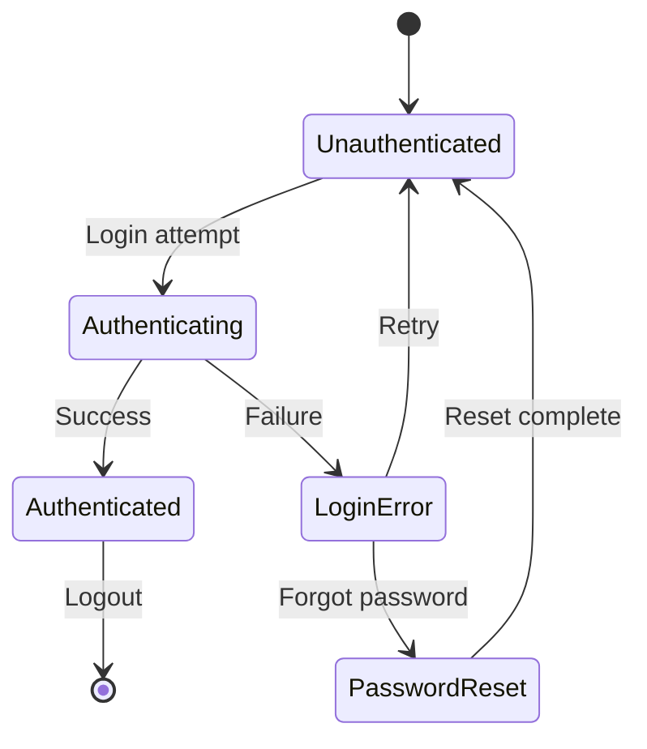

# Claude Development Guidelines

> **Core Principle**: These guidelines establish workflows, decision trees, and checkpoints that protect against wasted time and technical debt. The Work Plan Protocol takes priority for all development work.

> **Multi-Agent Architecture**: A sophisticated multi-agent system operates continuously in Claude Code to orchestrate work, optimize context, validate quality, and execute tasks in parallel.

## Table of Contents
1. [Multi-Agent Orchestration System](#1-multi-agent-orchestration-system)
2. [Work Plan Protocol](#2-work-plan-protocol) **START HERE**
3. [Agentic Workflow (Beads)](#3-agentic-workflow-beads)
4. [Critical Thinking & Pushback](#4-critical-thinking--pushback)
5. [Language Stack & Tooling](#5-language-stack--tooling)
6. [Testing & Validation](#6-testing--validation)
7. [Version Control & Git](#7-version-control--git)
8. [Experience Design + Development](#8-experience-design--development)
9. [Skills System](#9-skills-system)
10. [Anti-Patterns](#10-anti-patterns)
11. [Quick Reference](#11-quick-reference)

---

## 1. Multi-Agent Orchestration System

Four primary agents operate continuously in every Claude Code session:

### Agent 1: Orchestrator
**Role**: Central coordinator and state manager

**Responsibilities**:
- Coordinate handoffs between agents with zero-copy data passing
- Monitor execution state across parallel workstreams
- Prevent race conditions and deadlocks through dependency-aware scheduling
- Preserve context before compaction (75% threshold → `.claude/context-snapshots/`)
- Maintain global work graph and schedule parallel work

**Context Preservation**: Trigger pre-emptive snapshots at 75% utilization, compress non-critical data, checkpoint before phase transitions.

**Deadlock Prevention**: Maintain dependency graph, detect circular dependencies, implement timeout monitoring, use priority-based preemption.

---

### Agent 2: Optimizer
**Role**: Context and resource optimization specialist

**Responsibilities**:
- Construct optimal context payloads for each agent
- Apply ACE principles: incremental updates, structured accumulation, strategy preservation
- Monitor all context sources: agents, files, commits, plans, beads, skills, session
- Prevent brevity bias and context collapse
- **Dynamically discover and load relevant skills from filesystem**

**Skills Discovery**:
```
Task → Analyze keywords/domains
     → Scan skills/ directory
     → Score relevance (0-100)
     → Load top 3-7 skills
     → Cache for session
     → Refine as needs evolve
```

**Context Budget Allocation**: Critical (40%), Skills (30%), Project (20%), General (10%)

---

### Agent 3: Reviewer
**Role**: Quality assurance and validation specialist

**Responsibilities**:
- Validate intent satisfaction, documentation, test coverage
- Fact-check claims, references, external dependencies
- Check for anti-patterns and technical debt
- Block work until quality standards met
- Mark "COMPLETE" only when all gates pass

**Quality Gates** (all must pass):
- [ ] Intent satisfied
- [ ] Tests written and passing
- [ ] Documentation complete
- [ ] No anti-patterns
- [ ] Facts/references verified
- [ ] Constraints maintained
- [ ] No TODO/mock/stub comments

---

### Agent 4: Executor
**Role**: Primary work agent and sub-agent manager

**Responsibilities**:
- Follow Work Plan Protocol (Phases 1-4)
- Execute atomic tasks from plans
- Spawn sub-agents for safe parallel work
- Apply loaded skills
- Challenge vague requirements
- Implement code, tests, documentation
- Commit at checkpoints

**Sub-Agent Spawning** (all must pass):
- [ ] Task truly independent
- [ ] Context budget allows
- [ ] No circular dependencies
- [ ] Clear success criteria
- [ ] Handoff protocol established
- [ ] Rollback strategy exists

---

## 2. Work Plan Protocol

**MANDATORY**: Follow four phases for ALL work. Do not skip phases.

### Phase 1: Prompt → Spec
**Goal**: Transform request into clear specification

**Process**:
1. READ user request
2. DISCOVER relevant skills (Optimizer scans skills/)
3. LOAD discovered skills
4. IDENTIFY ambiguities
5. ASK clarifying questions
6. CONFIRM tech stack, deployment, constraints
7. WRITE spec.md
8. SUBMIT to Reviewer

**Exit Criteria**: Intent clear, ambiguities resolved, tech stack confirmed, skills loaded, spec reviewed.

---

### Phase 2: Spec → Full Spec
**Goal**: Decompose into components with dependencies and test plan

**Process**:
1. DECOMPOSE into components
2. IDENTIFY dependencies
3. DEFINE typed holes (interfaces/contracts)
4. SPECIFY constraints and invariants
5. CREATE test-plan.md
6. DOCUMENT edge cases
7. SUBMIT to Reviewer

**Test Plan** (create `test-plan.md`):
```markdown
## Test Types
- [ ] Unit tests for [components]
- [ ] Integration tests for [boundaries]
- [ ] E2E tests for [workflows]
- [ ] Property tests for [invariants]

## Coverage Targets
- Critical path: 90%+
- Business logic: 80%+
- UI layer: 60%+
- Overall: 70%+
```

**Exit Criteria**: Decomposed, dependencies mapped, typed holes defined, test plan created, reviewed.

---

### Phase 3: Full Spec → Plan
**Goal**: Create execution plan with parallelization

**Process**:
1. ORDER tasks by dependencies
2. IDENTIFY parallelization opportunities
3. COMPUTE critical path
4. PLAN checkpoints
5. CREATE plan.md
6. SUBMIT to Reviewer

**Execution Plan** (create `plan.md`):
```markdown
## Critical Path
1. [Highest priority task]
2. [Next critical task]

## Parallel Streams
### Stream A
- [ ] Task A1
- [ ] Task A2

### Stream B
- [ ] Task B1

## Dependencies
- Task X depends on Task Y

## Integration Points (Typed Holes)
- Interface X: Component A ↔ B
```

**Exit Criteria**: Tasks ordered, parallelization identified, critical path computed, reviewed.

---

### Phase 4: Plan → Artifacts
**Goal**: Execute plan, create code/tests/docs

**Process**:
1. CREATE Beads issues from plan
2. For each task:
   - IMPLEMENT code
   - WRITE tests
   - DOCUMENT APIs
   - COMMIT changes
   - RUN tests (after commit!)
   - SUBMIT to Reviewer
   - IF approved: Next task
   - IF not: Address feedback
3. VERIFY all typed holes filled
4. CONFIRM all tests passing

**Traceability** (maintain `traceability.md`):
```markdown
| Requirement | Spec | Implementation | Tests | Status |
|-------------|------|----------------|-------|--------|
| REQ-001     | spec.md#auth | auth.py | test_auth.py | ✓ |
```

**Exit Criteria**: All code implemented, tests passing, docs complete, typed holes filled, traceability verified.

---

### Phase Transitions

**CRITICAL**: Do not advance until exit criteria met and Reviewer approves.

```
Phase N complete? → Proceed to N+1
Phase N incomplete? → STOP, address gaps
Fundamental issues? → Roll back to earlier phase
```

---

## 3. Agentic Workflow (Beads)

**Tool**: Beads (https://github.com/steveyegge/beads) - AI-native task tracking

### Setup
```bash
go install github.com/steveyegge/beads/cmd/bd@latest
bd import -i .beads/issues.jsonl
```

### Workflow

**Session Start**:
```bash
bd import -i .beads/issues.jsonl
```

**Task Discovery**:
```bash
bd ready --json --limit 5                    # Get ready tasks
bd list --type bug --status open --json      # Filter by type
```

**Task Execution**:
```bash
bd update bd-5 --status in_progress --json
bd update bd-5 --comment "Progress note" --json
bd update bd-5 --blocked-by bd-7 --json
```

**Task Completion**:
```bash
bd close bd-5 --reason "Complete" --json     # After Reviewer approval
```

**Session End**:
```bash
bd export -o .beads/issues.jsonl
```

**Creating Tasks**:
```bash
bd create "Task description" -t feature -p 1 --json
bd update bd-10 --blocked-by bd-9 --json     # Link dependencies
```

---

## 4. Critical Thinking & Pushback

### When to Challenge

**ALWAYS challenge**:
- Vague requirements
- Unspecified tech stack
- Missing deployment details
- Unclear success criteria
- Requests to skip testing
- Pressure to skip phases

**Red Flags**:
```
🚩 "Quickly add..." → Scope vague
🚩 "Just make it work..." → Requirements unclear
🚩 "Don't worry about tests..." → Tech debt
🚩 "Use whatever..." → Stack undecided
🚩 "Skip the planning..." → Recipe for rework
```

**Good Pushback**:
```
"Before implementing, let's clarify [specific detail] to avoid 
[specific risk]. This will prevent [specific bad outcome]."
```

---

## 5. Language Stack & Tooling

### Python
```bash
uv init                          # Initialize
uv add package                   # Add dependency
uv run script.py                 # Run
uv run pytest                    # Test
```
**Best Practices**: Use `uv` (NOT pip/poetry), type hints with mypy, async with asyncio

### Zig
```bash
zig init && zig build && zig build test
```
**Best Practices**: Explicit allocators, comptime for metaprogramming, error unions

### Rust
```bash
cargo new && cargo add anyhow tokio && cargo build && cargo test
```
**Best Practices**: Result<T, E> for errors, leverage type system, async/await with tokio

### Go
```bash
go mod init && go get package && go build && go test ./...
```
**Best Practices**: Simple idiomatic Go, interface-based design, table-driven tests

### TypeScript
```bash
pnpm create vite@latest && pnpm install && pnpm dev && pnpm build
```
**Best Practices**: Strict TypeScript, Vite for tooling, React 18+ hooks, TanStack Query

---

## 6. Testing & Validation

**CRITICAL RULE**: Commit first, then test. NEVER test uncommitted code.

### Testing Protocol
```bash
# 1. Commit
git add . && git commit -m "Message" && git log -1 --oneline

# 2. Kill running tests
pkill -f "test"

# 3. Run tests in background
./run_tests.sh > /tmp/test_$(date +%Y%m%d_%H%M%S).log 2>&1 & wait

# 4. Check results
tail -f /tmp/test_output.log

# If fail: Fix → Commit → Re-test
```

### Test Types
- **Unit**: Individual functions/methods
- **Integration**: Module boundaries
- **E2E**: Complete workflows
- **Property**: Invariants across inputs
- **Performance**: Efficiency requirements

### Coverage Targets
- Critical path: 90%+
- Business logic: 80%+
- UI layer: 60%+
- Overall: 70%+

### API Key Access

**Anthropic API Key Configuration** (required for DSPy integration tests):

The system checks for API keys in this priority order:
1. **Environment variable**: `ANTHROPIC_API_KEY`
2. **Age-encrypted config**: `~/.config/mnemosyne/secrets.age` (or macOS Application Support)
3. **OS Keychain**: `mnemosyne.anthropic_api_key`

**Check Configuration Status**:
```bash
# Verify secrets system status
mnemosyne secrets info

# Show API key configuration
mnemosyne config show-key
```

**Set API Key** (choose one method):
```bash
# Method 1: Environment variable (temporary, session-only)
export ANTHROPIC_API_KEY="sk-ant-..."

# Method 2: Secure encrypted storage (recommended, persistent)
mnemosyne secrets init     # Interactive setup, creates encrypted config
# OR
mnemosyne config set-key   # Stores in OS keychain

# Method 3: Non-interactive setup
mnemosyne config set-key "sk-ant-..."  # Pass key as argument
```

**Get API Key**: https://console.anthropic.com/settings/keys

**Before Running DSPy Tests**:
```bash
# 1. Verify API key is accessible
mnemosyne config show-key

# 2. If not configured, set via environment or secrets
export ANTHROPIC_API_KEY="sk-ant-..."

# 3. Run tests with Python 3.14 compatibility
PYO3_USE_ABI3_FORWARD_COMPATIBILITY=1 cargo test --features python
```

**Testing with API Calls**:
```bash
# Python DSPy module tests (use uv)
cd src/orchestration/dspy_modules
PYO3_USE_ABI3_FORWARD_COMPATIBILITY=1 uv run pytest test_*.py -v

# Rust adapter integration tests (marked #[ignore], require API key)
PYO3_USE_ABI3_FORWARD_COMPATIBILITY=1 cargo test --features python -- --ignored
```

**Reference**: See `SECRETS_MANAGEMENT.md` for detailed documentation on the secrets system.

---

## 7. Version Control & Git

### Branching
```bash
# ALWAYS use feature branches (NEVER commit to main directly)
git checkout -b feature/name
git checkout -b fix/bug
```

### Commits
```bash
# Good
git commit -m "Add user authentication with JWT"
git commit -m "Fix race condition in cache"

# Bad
git commit -m "changes"
git commit -m "wip"
```

**CRITICAL**: Do NOT attribute commits to AI/Claude Code unless explicitly requested. Commit messages should describe the work, not the tool.

**Commit Frequency**: After logical units, before tests (MANDATORY), after tests pass, before context compaction, before session end.

### Pull Requests
```bash
git push -u origin feature/name
gh pr create --title "Title" --body "Description"
```

---

## 8. Experience Design + Development

**Principle**: Map experiences before implementing. Design flows, then build interfaces.

### Experience Mapping

**Purpose**: Visualize complete user journeys, identify failure modes, eliminate friction.

**Process**:
1. MAP states and flows using diagrams:
   - **Mermaid**: State machines, flowcharts, sequence diagrams
   - **Graphviz**: Complex state graphs, dependency trees
   - **Railroad diagrams**: Command syntax, input validation flows
   - **ASCII diagrams**: Quick sketches in docs/comments

2. ITERATE until flow is clean and intuitive:
   - Minimize clicks/steps to core actions
   - Reduce branching and decision points
   - Eliminate circular dependencies
   - Simplify state transitions

3. MINIMIZE failure states and dead ends:
   - Every error state needs recovery path
   - No "nowhere to go" screens
   - Failed actions suggest alternatives
   - Timeouts provide retry mechanisms

4. DOCUMENT state transitions and edge cases:
   - What triggers each transition?
   - What can go wrong at each step?
   - What's the recovery path?
   - Where can users get stuck?

**Example Flow Mapping**:


### State Design Checklist

**Every experience must handle**:
- [ ] **Loading**: Show progress, not blank screens
- [ ] **Error**: Clear message + recovery action
- [ ] **Empty**: Helpful guidance, not void
- [ ] **Success**: Confirmation + next action
- [ ] **Partial**: Handle incomplete data gracefully

**Anti-patterns**:
```
❌ Spinner without timeout → Infinite wait
❌ Error without action → Dead end
❌ Empty state without guidance → Confusion
❌ Success without next step → "Now what?"
```

### Implementation Priority

**Order of operations**:
1. MAP experience flows (diagrams)
2. IDENTIFY all states (loading, error, empty, success, partial)
3. DESIGN state transitions and recovery paths
4. IMPLEMENT using shadcn/ui blocks
5. TEST all states and edge cases

### Flow Documentation

**Create flow artifacts** in Phase 1-2:
- `flows/user-journey.mmd`: High-level user journeys
- `flows/state-machine.mmd`: Detailed state transitions
- `flows/error-recovery.mmd`: Error handling paths
- `docs/edge-cases.md`: Documented edge case behaviors

**Tools**:
```bash
# Generate diagram from mermaid
mmdc -i flows/state-machine.mmd -o flows/state-machine.svg

# Validate graphviz
dot -Tsvg flows/dependency.dot -o flows/dependency.svg
```

### Experience Validation

**Before implementation**:
- [ ] All user goals achievable
- [ ] No unreachable states
- [ ] Every error has recovery
- [ ] State machine is acyclic (no infinite loops)
- [ ] Edge cases documented

**During implementation**:
- [ ] Loading states implemented
- [ ] Error states with recovery actions
- [ ] Empty states with guidance
- [ ] Success states with next steps
- [ ] Responsive across devices

**Review criteria**:
- Can user achieve goal in minimum steps?
- Are failure modes obvious and recoverable?
- Does every screen have a clear purpose?
- Is navigation intuitive without documentation?

---

## 9. Skills System

### Dynamic Discovery

**Approach**: Skills discovered on-demand based on task requirements, not front-loaded.

**Skills Structure**:
```
skills/
├── _INDEX.md                    # Reference
├── skill-repo-discovery.md      # Auto-discovery for repos
├── skill-prompt-discovery.md    # Auto-discovery from prompts
├── api-*.md                     # API skills
├── testing-*.md                 # Testing skills
├── database-*.md                # Database skills
├── frontend-*.md                # Frontend/experience design skills
├── [domain]-*.md                # Domain-specific
```

### Discovery Protocol

**Automatic** (Phase 1):
```
User Request → Optimizer analyzes keywords/domains
            → Scans skills/ directory
            → Scores relevance (0-100)
            → Loads top 3-7 skills
            → Caches for session
            → Refines as task evolves
```

**Manual**:
```bash
ls skills/*.md                    # List all
ls skills/zig-*.md               # Domain-specific
cat skills/_INDEX.md             # View catalog
```

**Discovery Skills**:
- `skill-repo-discovery.md`: Analyzes repo, activates relevant skills
- `skill-prompt-discovery.md`: Analyzes prompts, suggests skills

### Context-Aware Loading

**Budget**: Critical (40%), Skills (30%), Project (20%), General (10%)

**Strategy**: Load based on relevance, cache frequently-used, unload low-priority when constrained, pre-load common combinations.

### Skill Composition

Complex tasks load multiple skills compositionally:
```
"Build authenticated API with database"
  → api-rest-design.md
  → api-authentication.md
  → database-postgres.md
  → testing-integration.md
  → containers-dockerfile.md
```

### Quality Standards
- ✅ YAML frontmatter with metadata
- ✅ CI-validated
- ✅ Size optimized (~300 lines avg)
- ✅ Clear, actionable guidance

---

## 10. Anti-Patterns

### Critical Violations
```
❌ Test before committing → Debug stale code
❌ Test while changing code → Invalid results
❌ Leave TODO/mocks/stubs → Implement or create Beads issue
❌ Commit to main directly → Use feature branches
❌ Accept vague requirements → Rework
❌ Skip multi-agent coordination → Race conditions
❌ Ignore context budgets → Context loss
❌ Bypass Reviewer → Bugs in production
❌ Front-load all skills → Context waste
```

### Quality Issues
```
❌ Assume tech stack
❌ Skip experience flow mapping
❌ Implement before mapping states
❌ Skip shadcn blocks exploration
❌ Restructure shadcn components
❌ Missing recovery paths for errors
❌ Use pip/poetry (use uv)
❌ Leave cloud resources running
❌ Add AI attribution to commits (unless explicitly requested by user)
```

### Recovery Protocol
1. STOP immediately
2. ASSESS damage
3. RESET to last known good state
4. FOLLOW correct procedure
5. DOCUMENT what went wrong

---

## 11. Quick Reference

### Language Commands
```bash
# Python
uv init && uv add pkg && uv run script.py

# Zig
zig init && zig build && zig build test

# Rust
cargo new && cargo add anyhow tokio && cargo build

# Go
go mod init && go get package && go run .

# TypeScript
pnpm create vite@latest && pnpm install && pnpm dev
```

### Cloud Commands
```bash
modal app deploy && modal app stop [name]
wrangler dev && wrangler deploy
```

### Git Commands
```bash
git checkout -b feature/name
git add . && git commit -m "message"
git push -u origin feature/name
gh pr create --title "Title" --body "Description"
```

### Beads Commands
```bash
go install github.com/steveyegge/beads/cmd/bd@latest
bd import -i .beads/issues.jsonl
bd ready --json --limit 5
bd create "Task" -t bug -p 1 --json
bd update bd-5 --status in_progress --json
bd close bd-5 --reason "Complete" --json
bd export -o .beads/issues.jsonl
```

### Testing Flow
```bash
git add . && git commit -m "Changes" && git log -1 --oneline
pkill -f "test"
./run_tests.sh > /tmp/test_$(date +%Y%m%d_%H%M%S).log 2>&1 & wait
tail -f /tmp/test_output.log
```

### Skills Discovery
```bash
# Automatic in Phase 1 - Optimizer discovers based on task

# Manual
ls skills/*.md                    # List all
ls skills/zig-*.md               # Domain-specific
cat skills/_INDEX.md             # View catalog
```

### Multi-Agent Commands
```bash
# Session start
go install github.com/steveyegge/beads/cmd/bd@latest && bd import -i .beads/issues.jsonl

# Context checkpoint
mkdir -p .claude/context-snapshots && \
date +%Y%m%d_%H%M%S | xargs -I {} cp context-current.json .claude/context-snapshots/session-{}.json

# Session end
bd export -o .beads/issues.jsonl && git add . && git commit -m "Session complete"
```

---

## Master Decision Tree

```
New request
  ↓
MULTI-AGENT ACTIVATION
  ├─ Orchestrator: Coordinating
  ├─ Optimizer: Discovering skills from skills/
  ├─ Reviewer: Ready to validate
  └─ Executor: Ready to work
  ↓
PHASE 1: Prompt → Spec (clarify, discover skills, refine)
  ↓
PHASE 2: Spec → Full Spec (decompose, deps, holes, test plan)
  ↓
PHASE 3: Full Spec → Plan (steps, deps, parallelization)
  ↓
PHASE 4: Plan → Artifacts (implementation, tests, docs)
  ↓
Requirements clear? NO → ASK
Tech stack confirmed? NO → CONFIRM
Edge cases considered? NO → CHALLENGE
Using Beads? YES → Follow workflow
Making changes? YES → Feature branch
Need validation? YES → Testing protocol (commit first!)
Context > 75%? YES → Compression, unload low-priority skills
Work complete? → Submit to Reviewer
Session ending? YES → Export, commit, cleanup
  ↓
Execute
```

---

## Enforcement Checklist

Before completing ANY task:
```
[ ] Multi-agents active and coordinating
[ ] Optimizer discovered and loaded relevant skills (not all)
[ ] Work Plan Protocol: Phase 1→2→3→4, all exit criteria met
[ ] Verified date/time if using timestamps
[ ] Challenged vague requirements
[ ] Confirmed tech stack and deployment
[ ] Used correct package manager
[ ] Mapped experience flows before implementation
[ ] Designed all states (loading, error, empty, success)
[ ] Considered shadcn blocks
[ ] Used feature branch
[ ] Testing protocol: commit first
[ ] Context managed proactively
[ ] Cloud resources cleaned up
[ ] Beads state exported
[ ] Changes committed (NO AI attribution unless user explicitly requests it)
[ ] All agents checkpointed before session end
```

**If any unchecked, stop and address it.**

---

## Conclusion

The multi-agent system with dynamic skill discovery, Work Plan Protocol, and quality gates prevents:
- Context loss and waste
- Quality issues
- Coordination failures
- Wasted effort
- Testing violations
- Vague requirements
- Wrong tools
- Poor Git hygiene

**Follow the Work Plan Protocol. Let agents orchestrate. Let Optimizer discover skills. Verify before advancing. Challenge assumptions. Commit before testing. Checkpoint before operations.**
