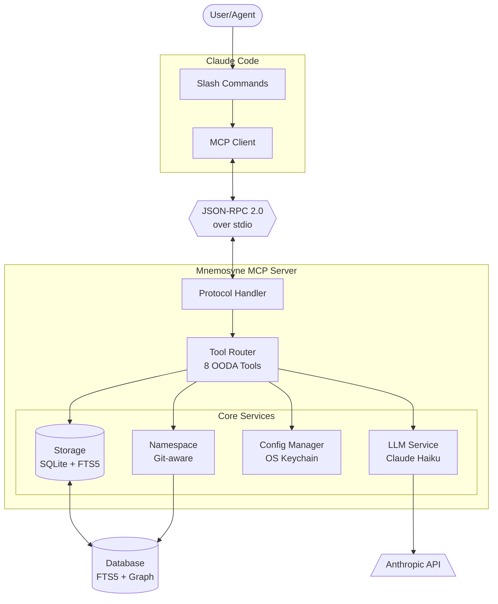

# Mnemosyne MCP Server

## Overview

The Mnemosyne MCP (Model Context Protocol) server provides JSON-RPC 2.0 interface over stdio for Claude Code integration. It implements 8 core memory tools organized around the OODA loop.

## Running the Server

```bash
# Start server (default command)
cargo run

# Start server explicitly
cargo run -- serve

# Start with debug logging
cargo run -- --log-level debug serve
```

## Protocol

### JSON-RPC 2.0

All communication uses JSON-RPC 2.0 over stdin/stdout:
- **Requests**: JSON objects on stdin, one per line
- **Responses**: JSON objects on stdout, one per line
- **Logs**: Sent to stderr (not stdout)

### Initialize

Before using the server, send an initialize request:

**Request:**
```json
{"jsonrpc":"2.0","method":"initialize","id":1}
```

**Response:**
```json
{
  "jsonrpc": "2.0",
  "result": {
    "protocolVersion": "2024-11-05",
    "serverInfo": {
      "name": "mnemosyne",
      "version": "0.1.0"
    },
    "capabilities": {
      "tools": {}
    }
  },
  "id": 1
}
```

## Tools

### List Available Tools

**Request:**
```json
{"jsonrpc":"2.0","method":"tools/list","id":2}
```

**Response:**
```json
{
  "jsonrpc": "2.0",
  "result": {
    "tools": [
      {
        "name": "mnemosyne.recall",
        "description": "Search memories by semantic query, keywords, or tags...",
        "input_schema": { ... }
      },
      ...
    ]
  },
  "id": 2
}
```

### 8 Core Tools (OODA Loop)

#### OBSERVE Tools

##### 1. mnemosyne.recall
Search memories by query.

**Request:**
```json
{
  "jsonrpc": "2.0",
  "method": "tools/call",
  "params": {
    "name": "mnemosyne.recall",
    "arguments": {
      "query": "database decisions",
      "namespace": "project:myapp",
      "max_results": 10,
      "min_importance": 5
    }
  },
  "id": 3
}
```

**Response:**
```json
{
  "jsonrpc": "2.0",
  "result": {
    "content": [
      {
        "type": "text",
        "text": "{\"results\": [...], \"query\": \"database decisions\"}"
      }
    ]
  },
  "id": 3
}
```

**Status:** Phase 5 (Hybrid Search) - Currently returns placeholder

##### 2. mnemosyne.list
List recent memories in namespace.

**Request:**
```json
{
  "jsonrpc": "2.0",
  "method": "tools/call",
  "params": {
    "name": "mnemosyne.list",
    "arguments": {
      "namespace": "project:myapp",
      "limit": 20
    }
  },
  "id": 4
}
```

**Status:** Phase 5 - Currently returns placeholder

#### ORIENT Tools

##### 3. mnemosyne.graph
Get memory graph from seed IDs.

**Request:**
```json
{
  "jsonrpc": "2.0",
  "method": "tools/call",
  "params": {
    "name": "mnemosyne.graph",
    "arguments": {
      "seed_ids": ["uuid-1", "uuid-2"],
      "max_hops": 2
    }
  },
  "id": 5
}
```

**Status:** ✅ **Implemented** - Uses storage backend graph traversal

##### 4. mnemosyne.context
Get full context for memory IDs.

**Request:**
```json
{
  "jsonrpc": "2.0",
  "method": "tools/call",
  "params": {
    "name": "mnemosyne.context",
    "arguments": {
      "memory_ids": ["uuid-1", "uuid-2"],
      "include_links": true
    }
  },
  "id": 6
}
```

**Status:** ✅ **Implemented** - Fetches memories from storage

#### DECIDE Tools

##### 5. mnemosyne.remember
Store new memory with LLM enrichment.

**Request:**
```json
{
  "jsonrpc": "2.0",
  "method": "tools/call",
  "params": {
    "name": "mnemosyne.remember",
    "arguments": {
      "content": "Decided to use PostgreSQL for user database because...",
      "namespace": "project:myapp",
      "importance": 9,
      "context": "Database selection discussion"
    }
  },
  "id": 7
}
```

**Response:**
```json
{
  "jsonrpc": "2.0",
  "result": {
    "content": [
      {
        "type": "text",
        "text": "{\"memory_id\": \"uuid\", \"summary\": \"...\", \"importance\": 9, \"tags\": [...]}"
      }
    ]
  },
  "id": 7
}
```

**Status:** ✅ **Implemented** - Uses LLM service for enrichment
**Requires:** ANTHROPIC_API_KEY

##### 6. mnemosyne.consolidate
Merge/supersede similar memories.

**Request:**
```json
{
  "jsonrpc": "2.0",
  "method": "tools/call",
  "params": {
    "name": "mnemosyne.consolidate",
    "arguments": {
      "memory_ids": ["uuid-1", "uuid-2"],
      "namespace": "project:myapp"
    }
  },
  "id": 8
}
```

**Status:** Phase 5 - Currently returns placeholder

#### ACT Tools

##### 7. mnemosyne.update
Update existing memory.

**Request:**
```json
{
  "jsonrpc": "2.0",
  "method": "tools/call",
  "params": {
    "name": "mnemosyne.update",
    "arguments": {
      "memory_id": "uuid",
      "content": "Updated content",
      "importance": 10,
      "add_tags": ["critical", "reviewed"]
    }
  },
  "id": 9
}
```

**Response:**
```json
{
  "jsonrpc": "2.0",
  "result": {
    "content": [
      {
        "type": "text",
        "text": "{\"memory_id\": \"uuid\", \"updated\": true}"
      }
    ]
  },
  "id": 9
}
```

**Status:** ✅ **Implemented** - Updates via storage backend

##### 8. mnemosyne.delete
Archive (soft delete) memory.

**Request:**
```json
{
  "jsonrpc": "2.0",
  "method": "tools/call",
  "params": {
    "name": "mnemosyne.delete",
    "arguments": {
      "memory_id": "uuid"
    }
  },
  "id": 10
}
```

**Status:** ✅ **Implemented** - Archives via storage backend

## Error Handling

### JSON-RPC Errors

The server returns standard JSON-RPC 2.0 errors:

```json
{
  "jsonrpc": "2.0",
  "error": {
    "code": -32601,
    "message": "Method not found: invalid_method"
  },
  "id": 1
}
```

**Standard Error Codes:**
- `-32700`: Parse error
- `-32600`: Invalid request
- `-32601`: Method not found
- `-32602`: Invalid params
- `-32603`: Internal error
- `-32000`: Application error (tool execution failed)

## Configuration

### API Key Setup

For tools requiring LLM services (e.g., `mnemosyne.remember`):

```bash
# Set API key in OS keychain
cargo run -- config set-key

# Or use environment variable
export ANTHROPIC_API_KEY=sk-ant-...

# Check API key status
cargo run -- config show-key
```

**Note:** The server will start without an API key, but LLM-dependent tools will return errors until configured.

## Testing

### Manual Testing

```bash
# Test initialize
echo '{"jsonrpc":"2.0","method":"initialize","id":1}' | cargo run -- serve

# Test list tools
echo '{"jsonrpc":"2.0","method":"tools/list","id":2}' | cargo run -- serve

# Test recall
echo '{"jsonrpc":"2.0","method":"tools/call","params":{"name":"mnemosyne.recall","arguments":{"query":"test"}},"id":3}' | cargo run -- serve
```

### Test Scripts

```bash
# Simple one-shot test
./scripts/testing/test_simple.sh

# Python test suite
python3 scripts/testing/test_server.py
```

## Implementation Status

| Tool | Status | Phase | Notes |
|------|--------|-------|-------|
| mnemosyne.recall | ⏳ Pending | Phase 5 | Hybrid search implementation |
| mnemosyne.list | ⏳ Pending | Phase 5 | Namespace-based listing |
| mnemosyne.graph | ✅ Complete | Phase 4 | Storage backend integration |
| mnemosyne.context | ✅ Complete | Phase 4 | Memory retrieval |
| mnemosyne.remember | ✅ Complete | Phase 4 | LLM enrichment working |
| mnemosyne.consolidate | ⏳ Pending | Phase 5 | LLM-guided consolidation |
| mnemosyne.update | ✅ Complete | Phase 4 | Storage backend integration |
| mnemosyne.delete | ✅ Complete | Phase 4 | Soft delete (archive) |

## Architecture



**Communication**: JSON-RPC 2.0 over stdin/stdout for seamless integration with Claude Code.

**8 OODA-Aligned Tools**:

| Phase | Tool | Purpose |
|-------|------|---------|
| **Observe** | `recall` | Search memories by query |
| **Observe** | `list` | Browse memories by filters |
| **Orient** | `graph` | Explore semantic relationships |
| **Orient** | `context` | Load full project context |
| **Decide** | `remember` | Store new memory with enrichment |
| **Decide** | `consolidate` | Merge/supersede duplicate memories |
| **Act** | `update` | Modify existing memory |
| **Act** | `delete` | Archive memory (soft delete) |

## Next Steps

**Phase 5: Hybrid Search & Consolidation**
1. Implement vector embeddings
2. Build hybrid search (vector + keyword + graph)
3. Implement memory consolidation
4. Complete `recall`, `list`, and `consolidate` tools
