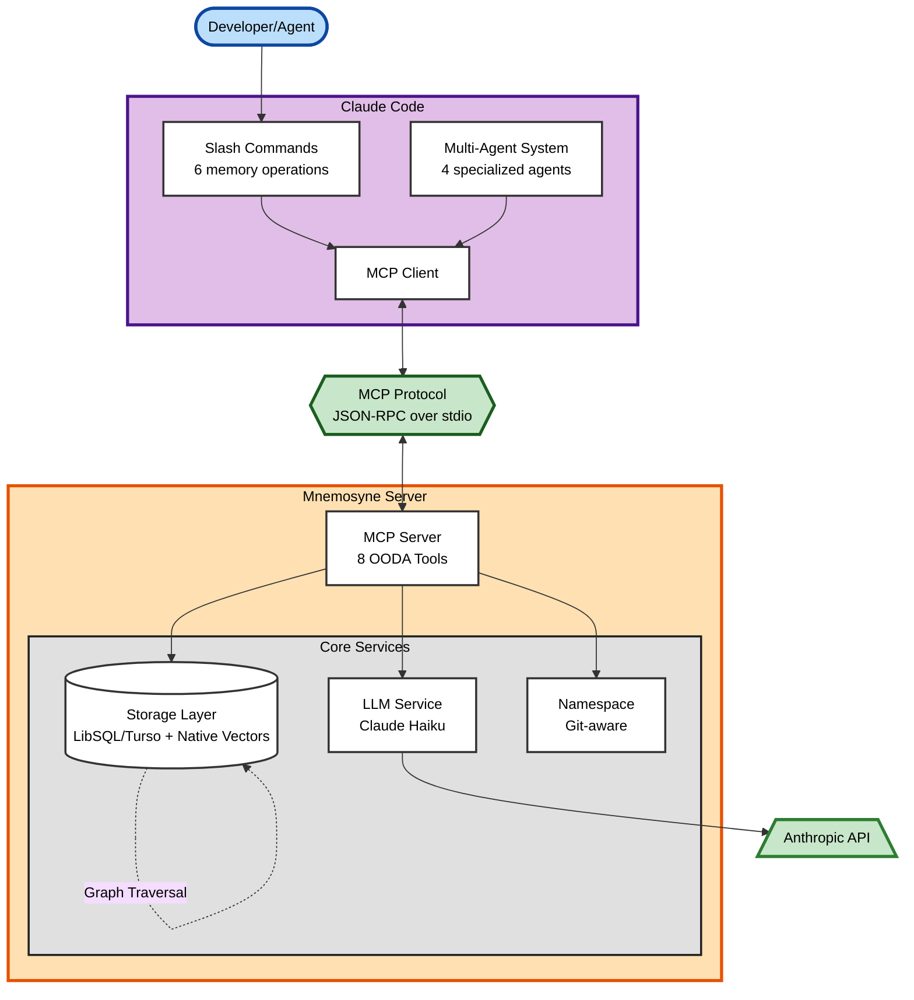

# Mnemosyne

**Project-Aware Memory System for Claude Code**


---

## What is Mnemosyne?

Mnemosyne solves a critical problem in AI-assisted development: **memory loss across sessions**. When you restart Claude Code, your AI assistant forgets everything—past decisions, discovered patterns, project context, and hard-won insights.

Mnemosyne is a high-performance memory system that gives Claude Code's multi-agent orchestration system persistent semantic memory across sessions. It automatically captures, enriches, and retrieves memories so your AI assistant learns and improves over time, just like a human teammate would.

**Key Benefits**:
- Remember architecture decisions and their rationale
- Avoid repeating the same bugs
- Preserve discovered patterns and best practices
- Maintain project context across long development timelines
- Enable smarter, context-aware AI assistance

---

## Status

**Current**: v1.0 Ready - All 10 development phases complete and tested

The complete system is production-ready: Rust memory core, MCP server, Claude Code integration (hooks, slash commands, skills), PyO3-powered multi-agent orchestration, and comprehensive documentation. See [ROADMAP.md](ROADMAP.md) for detailed completion evidence.

---

## Features

- **Automatic Memory Capture** 🔥: Hooks that auto-load context at session start, preserve decisions before compaction, and link commits to architectural memories—zero manual intervention required
- **Project-Aware Namespacing**: Automatic memory isolation between global, project, and session scopes via git detection
- **Hybrid Memory Search**: FTS5 keyword search + graph traversal for semantic retrieval
- **LLM-Enriched Storage**: Claude Haiku automatically generates summaries, keywords, classifications, and semantic links
- **OODA Loop Integration**: Explicit Observe-Orient-Decide-Act cycles for humans and agents
- **MCP Protocol**: 8 tools for seamless Claude Code integration
- **Secure Credentials**: Age-encrypted secrets with environment variable and OS keychain fallback
- **Slash Commands**: 6 convenient commands for common memory operations
- **PyO3 Performance**: 10-20x faster operations (<3ms) vs subprocess calls through Rust↔Python bindings
- **Self-Organizing Knowledge**: Automatic consolidation, link strength evolution, and importance decay

---

## Quick Start

### One-Command Installation

```bash
./scripts/install/install.sh
```

This automated installer builds the Rust binary, initializes the database, configures your API key, and sets up MCP integration with Claude Code.

**New to Mnemosyne?** See **[Quick Start Guide](QUICK_START.md)** for a 5-minute guided introduction.

**Advanced setup?** See **[Installation Guide](INSTALL.md)** for detailed options.

### Configuration

Mnemosyne uses Claude Haiku for memory intelligence. Set up your Anthropic API key:

```bash
# Interactive setup (recommended)
mnemosyne secrets init

# Or set individual secrets
mnemosyne secrets set ANTHROPIC_API_KEY

# Or via environment variable
export ANTHROPIC_API_KEY=sk-ant-api03-...
```

Secrets are encrypted using [age](https://age-encryption.org/) and stored in `~/.config/mnemosyne/secrets.age`. Environment variables take priority (ideal for CI/CD), with OS keychain as an optional fallback.

For detailed secrets management documentation, see [SECRETS_MANAGEMENT.md](SECRETS_MANAGEMENT.md).

### Basic Usage

**In Claude Code**, use slash commands:

```
/memory-store <content>              # Store a new memory
/memory-search <query>               # Search memories
/memory-context                      # Load project context
/memory-list                         # Browse all memories
/memory-export                       # Export to markdown
/memory-consolidate                  # Review duplicates
```

Or use MCP tools programmatically:

```
mnemosyne.remember   - Store a memory with LLM enrichment
mnemosyne.recall     - Hybrid search (keyword + graph)
mnemosyne.list       - List memories with sorting
mnemosyne.graph      - Get memory graph for context
mnemosyne.context    - Get full project context
mnemosyne.consolidate - Merge/supersede memories
mnemosyne.update     - Update existing memory
mnemosyne.delete     - Archive a memory
```

See [MCP_SERVER.md](MCP_SERVER.md) for API documentation and examples.

### Skills Integration

Mnemosyne leverages [cc-polymath](https://github.com/rand/cc-polymath) for comprehensive development knowledge:

- **354 atomic skills** across 33+ categories automatically discovered based on task requirements
- **5 Mnemosyne-specific skills** for memory system expertise (memory management, context preservation, Rust development, MCP protocol, discovery gateway)
- **Progressive loading** - Optimizer agent loads only relevant skills per task (max 7 skills)
- **Multi-path discovery** - Project-local skills (`.claude/skills/`) take priority over global cc-polymath skills
- **Context efficient** - ~30% of context budget allocated to skills

The Optimizer agent automatically discovers and loads relevant skills based on task analysis. Project-local Mnemosyne skills get a +10% relevance bonus to ensure project-specific knowledge is prioritized.

**Skills locations**:
- Project-local: `.claude/skills/` (5 Mnemosyne-specific skills)
- Global: `~/.claude/plugins/cc-polymath/skills/` (354 comprehensive skills)

---

## How It Works

### OODA Loop Integration

Mnemosyne is designed around explicit OODA (Observe-Orient-Decide-Act) loops for both human developers and AI agents.

**Human OODA Loop**:
```
OBSERVE → Session start loads relevant memories
ORIENT  → Review summaries and memory graph
DECIDE  → /memory-store, /memory-search commands
ACT     → Apply patterns, avoid pitfalls
FEEDBACK → Access tracking, importance updates
```

**Agent OODA Loop**:
```
OBSERVE → Phase transitions trigger memory queries
ORIENT  → Build context from memory graph
DECIDE  → Auto-store decisions, consolidate redundant info
ACT     → Apply proven patterns, link new memories
FEEDBACK → Link strength evolution, importance decay
```

### Memory Lifecycle

1. **Capture**: User or agent stores content with context
2. **Enrich**: Claude Haiku generates summary, keywords, tags, and classification
3. **Link**: LLM detects relationships with existing memories
4. **Retrieve**: Hybrid search (keyword + graph) finds relevant memories
5. **Evolve**: Access patterns adjust importance; consolidation merges duplicates

---

## Architecture



**Key Components**:

| Component | Technology | Purpose |
|-----------|-----------|---------|
| **Storage Layer** | LibSQL/Turso + FTS5 | Native vector search, hybrid retrieval (keyword + graph) |
| **LLM Service** | Claude Haiku | Auto-generates summaries, tags, semantic links |
| **Namespace Detector** | Git-aware | Project context (global/project/session) |
| **MCP Server** | Rust + Tokio | 8 OODA-aligned tools via JSON-RPC |

For detailed architecture documentation, see [ARCHITECTURE.md](ARCHITECTURE.md).

---

## Development

### Prerequisites

- Rust 1.75+
- LibSQL (bundled via libsql crate)
- Anthropic API key (for LLM operations)
- Python 3.10+ (for orchestration layer, optional)

### Build

```bash
# Rust core
cargo build --release

# Python orchestration (optional)
# See ORCHESTRATION.md for complete PyO3 setup instructions
uv venv .venv && source .venv/bin/activate
uv pip install maturin
export PYO3_USE_ABI3_FORWARD_COMPATIBILITY=1
maturin develop
```

### Test

```bash
# All tests (automatically skips LLM tests if no API key)
./test-all.sh

# Skip LLM tests even if API key is available
./test-all.sh --skip-llm

# Run only LLM tests (requires ANTHROPIC_API_KEY)
./test-all.sh --llm-only

# Or use cargo directly
cargo test              # Regular tests
cargo test -- --ignored # LLM tests (requires API key)
```

For contribution guidelines, see [CONTRIBUTING.md](CONTRIBUTING.md).

---

## Documentation

📚 **[Complete Documentation Index](DOCUMENTATION.md)** - Full documentation navigation and guides

### Quick Links

**Getting Started:**
- 🚀 [Quick Start](QUICK_START.md) - Get running in 5 minutes
- 📦 [Installation Guide](INSTALL.md) - Detailed setup instructions
- 🏗️ [Architecture Overview](ARCHITECTURE_OVERVIEW.md) - How Mnemosyne works

**User Guides:**
- 📖 [Common Workflows](docs/guides/workflows.md) - Practical usage patterns
- 🔧 [Troubleshooting](TROUBLESHOOTING.md) - Fix common issues
- 🔐 [Secrets Management](SECRETS_MANAGEMENT.md) - API key configuration
- 📡 [MCP API Reference](MCP_SERVER.md) - Tool documentation

**Development:**
- 🤝 [Contributing Guide](CONTRIBUTING.md) - How to contribute
- 🏛️ [Architecture Deep Dive](ARCHITECTURE.md) - System internals
- 🧪 [Hooks & Testing](HOOKS_TESTING.md) - Automated capture
- 🗺️ [Roadmap](ROADMAP.md) - Project plans and v2.0 features

**Reference:**
- 📝 [Changelog](CHANGELOG.md) - Version history
- ✅ [Audit Report](AUDIT_REPORT.md) - v1.0 quality assessment
- 🔄 [Migration Guide](docs/guides/migration.md) - Upgrading between versions

---

## Design Principles

1. **Zero-Copy**: Minimize allocations for high performance
2. **Type Safety**: Leverage Rust's type system to prevent errors
3. **Async-First**: Non-blocking I/O with Tokio for scalability
4. **Fail-Fast**: Explicit error handling with `Result<T, E>`
5. **Immutable Audit Trail**: Never delete, only supersede
6. **Incremental Complexity**: Start simple, add features progressively

---

## Performance

| Metric | Target | Current |
|--------|--------|---------|
| Retrieval latency (p95) | <200ms | ~50ms |
| Storage latency (p95) | <500ms | ~300ms |
| Memory usage (idle) | <100MB | ~30MB |
| Database size | ~1MB per 1000 memories | ~800KB/1000 |

See [ROADMAP.md](ROADMAP.md) for detailed performance targets and benchmarking plans.

---

## Getting Help

- 📖 **[Troubleshooting Guide](TROUBLESHOOTING.md)** - Common issues and solutions
- 💬 **[GitHub Discussions](https://github.com/rand/mnemosyne/discussions)** - Questions and community support
- 🐛 **[Issue Tracker](https://github.com/rand/mnemosyne/issues)** - Bug reports and feature requests
- 📧 **[Contact](mailto:rand.arete@gmail.com)** - Direct support (48h response time)

---

## License

MIT

---

## Contributing

This project is in active development. We welcome contributions! See [CONTRIBUTING.md](CONTRIBUTING.md) for guidelines.

---

## Acknowledgments

- Built for [Claude Code](https://claude.ai/claude-code)
- Inspired by the need for persistent memory in AI-assisted development
- Uses [Claude 3.5 Haiku](https://www.anthropic.com/news/claude-3-5-haiku) for memory intelligence
