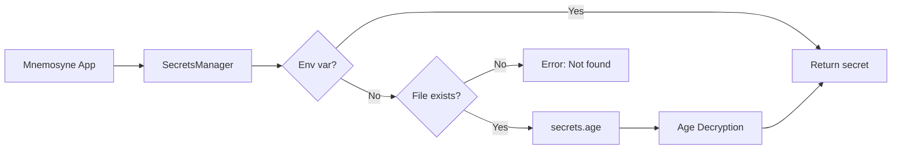

# Secrets Management

**Secure, user-friendly secrets management for Mnemosyne**

## Overview

Mnemosyne uses a multi-layered approach to secrets management that prioritizes security, usability, and zero manual configuration:

1. **Environment variables** (highest priority) - For CI/CD and container deployments
2. **Age-encrypted config file** (primary method) - Secure local storage with zero external dependencies
3. **OS keychain** (optional fallback) - For backward compatibility

This design ensures:
- ✅ **Zero manual installation** - All dependencies bundled with Mnemosyne
- ✅ **Secure by default** - Age encryption with 0600 file permissions
- ✅ **CI/CD friendly** - Environment variables work seamlessly
- ✅ **User-friendly** - Interactive setup wizard
- ✅ **Non-brittle** - Multiple fallback mechanisms

---

## Quick Start

### First-Time Setup

```bash
# Initialize secrets management (interactive)
mnemosyne secrets init

# You'll be prompted for:
# - ANTHROPIC_API_KEY (required)
# - TURSO_AUTH_TOKEN (optional, for Turso Cloud)
```

This command:
1. Generates a secure age encryption keypair
2. Saves the private key to `~/.config/mnemosyne/identity.key` (0600 permissions)
3. Prompts for required and optional secrets
4. Encrypts secrets to `~/.config/mnemosyne/secrets.age`

**Get your Anthropic API key**: https://console.anthropic.com/settings/keys

### Setting Individual Secrets

```bash
# Interactive prompt (recommended)
mnemosyne secrets set ANTHROPIC_API_KEY

# Or provide value directly
mnemosyne secrets set ANTHROPIC_API_KEY sk-ant-api03-...
```

### Viewing Configuration

```bash
# Show secrets info (doesn't reveal values)
mnemosyne secrets info

# List configured secrets
mnemosyne secrets list

# Get a specific secret (for debugging)
mnemosyne secrets get ANTHROPIC_API_KEY
```

---

## Priority Order

When Mnemosyne looks for a secret, it checks in this order:

1. **Environment variable** - `export ANTHROPIC_API_KEY=sk-ant-...`
2. **Encrypted config file** - `~/.config/mnemosyne/secrets.age`
3. **OS keychain** (if `keyring-fallback` feature enabled) - macOS Keychain, Windows Credential Manager, Linux Secret Service

This ensures:
- Environment variables always win (critical for CI/CD)
- Local development uses encrypted config (secure and portable)
- Backward compatibility with older Mnemosyne installations

---

## Environment Variables (Recommended for CI/CD)

```bash
# Set in shell
export ANTHROPIC_API_KEY=sk-ant-api03-...

# Or in .env file (NEVER commit to git!)
echo "ANTHROPIC_API_KEY=sk-ant-api03-..." > .env
source .env

# Verify
echo $ANTHROPIC_API_KEY | wc -c  # Should be >50 chars
```

**For GitHub Actions**:

```yaml
name: Tests
on: [push]
jobs:
  test:
    runs-on: ubuntu-latest
    steps:
      - uses: actions/checkout@v3
      - name: Run tests
        env:
          ANTHROPIC_API_KEY: ${{ secrets.ANTHROPIC_API_KEY }}
        run: cargo test
```

---

## Age-Encrypted Config (Recommended for Local Development)

### How It Works

1. **First run**: `mnemosyne secrets init` generates an age keypair
   - Private key: `~/.config/mnemosyne/identity.key` (keep this safe!)
   - Encrypted secrets: `~/.config/mnemosyne/secrets.age`

2. **Storage**: Secrets are stored as encrypted JSON
   ```json
   {
     "ANTHROPIC_API_KEY": "sk-ant-api03-...",
     "TURSO_AUTH_TOKEN": "eyJ..."
   }
   ```

3. **Encryption**: Uses age (https://github.com/FiloSottile/age)
   - Modern, secure, simple
   - X25519 key exchange + ChaCha20-Poly1305 authenticated encryption
   - ASCII-armored output for easy backup

4. **Permissions**: Files are set to 0600 (owner read/write only) on Unix systems

### File Locations

- **macOS/Linux**: `~/.config/mnemosyne/`
  - `identity.key` - Private key (0600)
  - `secrets.age` - Encrypted secrets (0600)

- **Windows**: `%APPDATA%\mnemosyne\mnemosyne\config\`
  - `identity.key` - Private key
  - `secrets.age` - Encrypted secrets

### Backing Up

```bash
# Backup your encryption key (keep this VERY safe!)
cp ~/.config/mnemosyne/identity.key ~/Dropbox/secure-backup/

# Or print and store physically
cat ~/.config/mnemosyne/identity.key
```

**Warning**: If you lose `identity.key`, your secrets cannot be decrypted! Back it up securely.

### Restoring

```bash
# Copy identity key to new machine
cp ~/secure-backup/identity.key ~/.config/mnemosyne/

# Secrets will be automatically decrypted
mnemosyne secrets list
```

---

## OS Keychain (Backward Compatibility)

The OS keychain is available as an optional fallback for backward compatibility with older Mnemosyne installations.

**Enable keyring fallback** (default):

```toml
# Cargo.toml
[features]
default = ["keyring-fallback"]
```

**Disable keyring** (if you only want age encryption):

```bash
cargo build --no-default-features
```

### Using Keychain

```bash
# Set API key (keyring-only method, legacy)
mnemosyne config set-key

# Get API key
mnemosyne config show-key

# Delete API key
mnemosyne config delete-key
```

**Note**: We recommend using `mnemosyne secrets` commands instead, which support both age encryption and keyring.

---

## Secrets Reference

### Required Secrets

| Secret | Purpose | Where to Get |
|--------|---------|--------------|
| `ANTHROPIC_API_KEY` | Claude Haiku API access | https://console.anthropic.com/settings/keys |

### Optional Secrets

| Secret | Purpose | Where to Get |
|--------|---------|--------------|
| `TURSO_AUTH_TOKEN` | Turso Cloud database access | https://turso.tech/app |

**Note**: Turso Cloud is completely optional. Mnemosyne works perfectly with local LibSQL databases.

---

## Security Best Practices

### DO ✅

- Use `mnemosyne secrets init` for interactive setup
- Set 0600 permissions on config files (automatic on Unix)
- Back up `identity.key` to a secure location
- Use environment variables in CI/CD pipelines
- Rotate API keys periodically
- Never commit secrets to git (add `.env` to `.gitignore`)

### DON'T ❌

- Share `identity.key` publicly or commit to git
- Store secrets in plain text files
- Hard-code API keys in code
- Use the same API key across multiple projects (if possible)
- Email or slack API keys (use password managers instead)

### Rotating API Keys

```bash
# Generate new API key from Anthropic Console
# https://console.anthropic.com/settings/keys

# Update in Mnemosyne
mnemosyne secrets set ANTHROPIC_API_KEY sk-ant-NEW-KEY-...

# Verify
mnemosyne secrets info
```

---

## Troubleshooting

### "Secret not found" Error

```bash
# Check which secrets are configured
mnemosyne secrets list

# Check if environment variable is set
env | grep ANTHROPIC_API_KEY

# Check secrets info
mnemosyne secrets info

# Re-initialize if needed
mnemosyne secrets init
```

### Permission Errors on Unix

```bash
# Fix file permissions
chmod 600 ~/.config/mnemosyne/identity.key
chmod 600 ~/.config/mnemosyne/secrets.age
```

### Lost Encryption Key

If you lose `~/.config/mnemosyne/identity.key`:

1. **With backup**: Restore from backup
   ```bash
   cp ~/secure-backup/identity.key ~/.config/mnemosyne/
   ```

2. **Without backup**: Re-initialize (you'll need to re-enter secrets)
   ```bash
   rm -rf ~/.config/mnemosyne/
   mnemosyne secrets init
   ```

### CI/CD Tests Failing

```bash
# Ensure environment variable is set
export ANTHROPIC_API_KEY=sk-ant-...

# Verify it's accessible
echo $ANTHROPIC_API_KEY | head -c 20

# Run tests
cargo test
```

For GitHub Actions, set the secret in repository settings:
- Settings → Secrets and variables → Actions → New repository secret

---

## Testing

### Running Tests

```bash
# All tests (uses environment variable if set)
cargo test

# Skip LLM tests (don't need API key)
./test-all.sh --skip-llm

# Run only LLM tests (requires API key)
./test-all.sh --llm-only
```

### Test Requirements

- **Unit tests**: No API key required (marked with `#[ignore]` if needed)
- **Integration tests**: No API key required
- **LLM tests**: Require `ANTHROPIC_API_KEY` (automatically skipped if not available)

The test suite automatically detects API key availability and skips tests gracefully if not found.

---

## Architecture Details

### Encryption Flow


### Decryption Flow



### Code Structure

```
src/
├── secrets.rs           # SecretsManager with age encryption
├── config.rs            # ConfigManager (uses SecretsManager)
└── main.rs              # CLI commands (mnemosyne secrets ...)

Dependencies:
├── age                  # Encryption library
├── secrecy              # Zero-copy secret handling
├── directories          # Cross-platform config paths
└── keyring (optional)   # OS keychain fallback
```

---

## Migration Guide

### From Keyring to Age Encryption

If you're using an older version of Mnemosyne with keyring-only storage:

```bash
# 1. Get your current API key from keyring
OLD_KEY=$(mnemosyne config show-key)

# 2. Initialize age encryption
mnemosyne secrets init

# 3. (The init wizard will prompt you to enter the API key)
# Or set it directly:
mnemosyne secrets set ANTHROPIC_API_KEY "$OLD_KEY"

# 4. Verify
mnemosyne secrets list

# 5. (Optional) Remove from keyring
mnemosyne config delete-key
```

Both methods will continue to work side-by-side. The age-encrypted config takes priority over keyring.

---

## FAQ

**Q: Is age encryption secure?**
A: Yes! Age uses modern cryptography (X25519 + ChaCha20-Poly1305) and is audited. See https://age-encryption.org/

**Q: Can I use both environment variables and encrypted config?**
A: Yes! Environment variables take priority, so you can override config values in CI/CD.

**Q: What happens if I delete the encrypted config file?**
A: Mnemosyne will fall back to environment variables or OS keychain (if configured). You can re-run `mnemosyne secrets init` to recreate it.

**Q: Is the encryption key password-protected?**
A: No, the age keypair is stored unencrypted in `identity.key` (protected by file system permissions). For additional security, you could store `identity.key` on an encrypted volume or use full-disk encryption.

**Q: Can I use this with multiple projects?**
A: Yes! The secrets are stored in a central location (`~/.config/mnemosyne/`) and available to all Mnemosyne instances on your machine. If you need project-specific secrets, use environment variables.

**Q: Does this work on Windows?**
A: Yes! File locations differ (`%APPDATA%\mnemosyne\mnemosyne\config\`), but the encryption works the same way. File permissions are handled by NTFS ACLs.

---

## Related Documentation

- [README.md](README.md) - Project overview and quick start
- [INSTALL.md](INSTALL.md) - Installation guide
- [CONTRIBUTING.md](CONTRIBUTING.md) - Development and testing guide

---

## Support

If you encounter issues with secrets management:

1. Check `mnemosyne secrets info` for configuration details
2. Verify file permissions: `ls -la ~/.config/mnemosyne/`
3. Review this guide's troubleshooting section
4. Open an issue: https://github.com/rand/mnemosyne/issues
