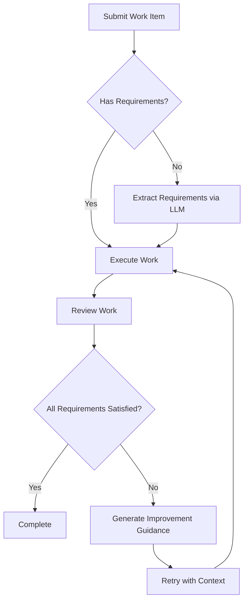

# LLM-Enhanced Reviewer Guide

## Overview

The Mnemosyne orchestration system includes an LLM-enhanced Reviewer agent that provides semantic validation and requirement tracking for work items. This document describes the features, configuration, and usage of the LLM reviewer.

## Features

### 1. Automatic Requirement Extraction

The reviewer can automatically extract explicit requirements from work item descriptions using an LLM:

```rust
// Automatic extraction when work item has no explicit requirements
let work_item = WorkItem::new(
    "Implement user authentication with JWT tokens and session management".to_string(),
    AgentRole::Executor,
    Phase::PlanToArtifacts,
    5,
);

// Reviewer extracts requirements:
// - "Implement JWT token generation"
// - "Implement JWT token validation"
// - "Implement session management"
// - "Add user authentication endpoints"
```

### 2. Semantic Validation

Three-pillar semantic validation using LLM analysis:

- **Intent Satisfaction**: Does the implementation satisfy the original intent?
- **Completeness**: Are all explicit requirements fully implemented?
- **Correctness**: Is the logic sound and free of bugs?

### 3. Requirement Tracking

Track requirement satisfaction status across retry attempts:

```rust
pub enum RequirementStatus {
    NotStarted,    // Requirement identified but not implemented
    InProgress,    // Partial implementation or failed validation
    Satisfied,     // Requirement fully satisfied with evidence
}
```

Each satisfied requirement includes evidence (memory IDs) linking to implementation artifacts.

### 4. Improvement Guidance

When review fails, the LLM generates actionable improvement guidance:

```rust
pub struct ReviewFeedback {
    pub improvement_guidance: Option<String>,
    pub unsatisfied_requirements: Vec<String>,
    pub satisfied_requirements: HashMap<String, Vec<MemoryId>>,
    // ...
}
```

## Configuration

### ReviewerConfig

Configure LLM behavior through the `ReviewerConfig` struct:

```rust
#[cfg(feature = "python")]
pub struct ReviewerConfig {
    /// Maximum number of retry attempts for LLM calls
    pub max_llm_retries: u32,

    /// Timeout for LLM calls in seconds
    pub llm_timeout_secs: u64,

    /// Enable/disable LLM validation (false = pattern matching only)
    pub enable_llm_validation: bool,

    /// LLM model name
    pub llm_model: String,

    /// Maximum tokens for LLM context
    pub max_context_tokens: usize,

    /// Temperature for LLM generation (0.0-1.0)
    pub llm_temperature: f32,
}
```

### Default Configuration

```rust
ReviewerConfig::default() // Uses:
// - max_llm_retries: 3
// - llm_timeout_secs: 60
// - enable_llm_validation: true
// - llm_model: "claude-3-5-sonnet-20241022"
// - max_context_tokens: 4096
// - llm_temperature: 0.0 (deterministic)
```

### Custom Configuration

```rust
let mut config = ReviewerConfig::default();
config.max_llm_retries = 5;
config.llm_timeout_secs = 120;
config.llm_model = "claude-3-opus-20240229".to_string();

state.update_config(config);
```

## Error Handling

### Retry Logic with Exponential Backoff

All LLM operations use automatic retry with exponential backoff:

- **Attempt 1**: Immediate execution
- **Attempt 2**: After 1 second backoff
- **Attempt 3**: After 2 second backoff
- **Attempt 4**: After 4 second backoff
- ...

### Error Types

```rust
pub enum MnemosyneError {
    /// Generic LLM API error
    LlmApi(String),

    /// LLM operation timed out
    LlmTimeout(u64),

    /// All retry attempts exhausted
    LlmRetryExhausted(u32, String),

    /// Python interop error (PyO3)
    PythonInterop(String),
    // ...
}
```

### Graceful Degradation

If LLM validation fails after all retries, the reviewer gracefully degrades to pattern-based validation:

```rust
// LLM extraction failed → continue with empty requirements
match state.extract_requirements_from_intent(&work_item).await {
    Ok(requirements) => requirements,
    Err(e) => {
        tracing::warn!("LLM extraction failed, continuing without: {}", e);
        Vec::new()
    }
}
```

## Workflow

### Work Item Lifecycle with Requirement Tracking



### Example: Multi-Attempt Workflow

```rust
// Attempt 1: Partial satisfaction
let feedback_1 = ReviewFeedback {
    gates_passed: false,
    satisfied_requirements: {
        "JWT token generation" => [mem_1, mem_2]
    },
    unsatisfied_requirements: [
        "JWT token validation",
        "Session management"
    ],
    improvement_guidance: Some(
        "Focus on implementing JWT validation middleware and session storage"
    ),
    // ...
};

// Attempt 2: Full satisfaction
let feedback_2 = ReviewFeedback {
    gates_passed: true,
    satisfied_requirements: {
        "JWT token generation" => [mem_1, mem_2],
        "JWT token validation" => [mem_3, mem_4],
        "Session management" => [mem_5, mem_6]
    },
    unsatisfied_requirements: [],
    // ...
};
```

## Python Integration

### Registering the Python Reviewer

```rust
use pyo3::prelude::*;
use std::sync::Arc;

// Create Python ReviewerAgent (from Python side)
let py_reviewer: Arc<PyObject> = /* ... */;

// Register with Rust reviewer
state.register_py_reviewer(py_reviewer);
// Automatically enables LLM validation
```

### Python ReviewerAgent Interface

The Python side must implement these methods:

```python
class ReviewerAgent:
    def extract_requirements_from_intent(
        self,
        original_intent: str,
        context: Optional[str] = None
    ) -> List[str]:
        """Extract explicit requirements from user intent."""
        # Use Claude API to analyze intent
        # Return list of structured requirements
        pass

    def semantic_intent_check(
        self,
        original_intent: str,
        implementation_content: str,
        execution_memory_ids: List[str]
    ) -> Tuple[bool, List[str]]:
        """Validate that implementation satisfies intent."""
        # Return (passed, issues)
        pass

    def semantic_completeness_check(
        self,
        requirements: List[str],
        implementation_content: str,
        execution_memory_ids: List[str]
    ) -> Tuple[bool, List[str]]:
        """Validate that all requirements are implemented."""
        # Return (passed, missing_requirements)
        pass

    def semantic_correctness_check(
        self,
        implementation_content: str,
        test_results: Dict,
        execution_memory_ids: List[str]
    ) -> Tuple[bool, List[str]]:
        """Validate logical correctness and absence of bugs."""
        # Return (passed, logic_issues)
        pass

    def generate_improvement_guidance(
        self,
        failed_gates: Dict[str, bool],
        issues: List[str],
        original_intent: str,
        execution_memory_ids: List[str]
    ) -> str:
        """Generate actionable guidance for failed reviews."""
        # Return improvement plan
        pass
```

## Usage Examples

### Example 1: Basic Usage

```rust
use mnemosyne::orchestration::{
    actors::reviewer::{ReviewerActor, ReviewerState, ReviewerConfig},
    messages::ReviewerMessage,
};

// Create reviewer with default config
let state = ReviewerState::new(storage, namespace);

// Register Python reviewer
state.register_py_reviewer(py_reviewer);

// Work item automatically gets requirements extracted
let work_item = WorkItem::new(
    "Add rate limiting to API endpoints".to_string(),
    AgentRole::Executor,
    Phase::PlanToArtifacts,
    5,
);
```

### Example 2: Custom Configuration

```rust
// Custom configuration for high-priority work
let config = ReviewerConfig {
    max_llm_retries: 5,              // More retries
    llm_timeout_secs: 180,           // Longer timeout
    enable_llm_validation: true,
    llm_model: "claude-3-opus-20240229".to_string(), // More capable model
    max_context_tokens: 8192,        // More context
    llm_temperature: 0.1,            // Slightly more creative
};

state.update_config(config);
```

### Example 3: Disabling LLM Validation

```rust
// Temporarily disable LLM validation (e.g., for testing)
state.disable_llm_validation();

// Re-enable by updating config
let mut config = state.config.clone();
config.enable_llm_validation = true;
state.update_config(config);
```

### Example 4: Accessing Review Results

```rust
// After review completes
match feedback.gates_passed {
    true => {
        println!("Review passed!");
        println!("Satisfied requirements:");
        for (req, evidence) in &feedback.satisfied_requirements {
            println!("  - {} (evidence: {} memories)", req, evidence.len());
        }
    }
    false => {
        println!("Review failed:");
        for issue in &feedback.issues {
            println!("  - {}", issue);
        }
        if let Some(guidance) = &feedback.improvement_guidance {
            println!("\nImprovement guidance:\n{}", guidance);
        }
    }
}
```

## Testing

### Unit Tests

The reviewer includes comprehensive unit tests for requirement tracking:

```bash
cargo test --lib orchestration::actors::reviewer::tests
```

### Integration Tests

E2E tests simulate multi-attempt workflows:

```bash
cargo test --lib orchestration::supervision::tests::test_e2e_retry_workflow_with_requirements
```

### Mocking LLM Responses

For testing without LLM API calls:

```rust
// Disable LLM validation for tests
state.disable_llm_validation();

// Or provide explicit requirements instead of extraction
let mut work_item = WorkItem::new(...);
work_item.requirements = vec![
    "Requirement 1".to_string(),
    "Requirement 2".to_string(),
];
```

## Performance Considerations

### Context Budget

- Each LLM call consumes context tokens
- Default limit: 4096 tokens per call
- Implementation content truncated to 500 chars per memory
- Maximum 20 memories included in validation

### Timeout Strategy

- Default timeout: 60 seconds per LLM call
- Adjust based on model speed and complexity:
  - Simple validation: 30-60s
  - Complex analysis: 120-180s

### Retry Strategy

- Exponential backoff prevents API rate limiting
- 3 retries balances reliability vs latency:
  - Total time: ~60s + 1s + 2s + 4s = ~67s max
  - Increase retries for critical work items

## Troubleshooting

### Issue: LLM Calls Timing Out

**Solution**: Increase timeout or reduce context size

```rust
config.llm_timeout_secs = 120;
config.max_context_tokens = 2048; // Smaller context
```

### Issue: Retry Exhaustion

**Symptom**: `LlmRetryExhausted` error after max attempts

**Solutions**:
1. Check Python ReviewerAgent implementation
2. Verify Claude API key is valid
3. Increase max retries for flaky operations
4. Add better error handling in Python code

### Issue: Requirements Not Extracted

**Check**:
1. Is `enable_llm_validation` set to true?
2. Is Python reviewer registered?
3. Check logs for extraction errors

```bash
RUST_LOG=mnemosyne_core::orchestration::actors::reviewer=debug cargo run
```

### Issue: Python Interop Errors

**Common causes**:
- Python method signature mismatch
- Type conversion errors (Rust ↔ Python)
- GIL (Global Interpreter Lock) issues

**Debug**:
```bash
RUST_LOG=mnemosyne_core::python_bindings=debug cargo run
```

## Best Practices

### 1. Explicit Requirements

Provide explicit requirements when possible to avoid extraction overhead:

```rust
let mut work_item = WorkItem::new(...);
work_item.requirements = vec![
    "Implement authentication middleware".to_string(),
    "Add session validation".to_string(),
    "Include rate limiting".to_string(),
];
```

### 2. Appropriate Model Selection

- **Simple tasks**: claude-3-haiku (fast, cheap)
- **Standard tasks**: claude-3-5-sonnet (default, balanced)
- **Complex tasks**: claude-3-opus (most capable)

### 3. Timeout Tuning

Match timeouts to expected LLM response time:
- Haiku: 30s
- Sonnet: 60s
- Opus: 120s

### 4. Temperature Settings

- **Validation** (0.0): Deterministic, consistent
- **Generation** (0.3-0.7): Creative guidance
- **Extraction** (0.0-0.1): Structured output

### 5. Monitoring

Enable detailed logging for production:

```bash
RUST_LOG=mnemosyne_core::orchestration::actors::reviewer=info
```

Track metrics:
- LLM call success rate
- Average retry count
- Requirement satisfaction rate
- Review pass/fail ratio

## Future Enhancements

Planned features:

1. **Streaming LLM responses** for faster feedback
2. **Caching** of requirement extractions
3. **Batch validation** for multiple work items
4. **Custom validation rules** per work item type
5. **LLM cost tracking** and budget management

## Related Documentation

- [Multi-Agent Architecture](../specs/multi-agent-architecture.md)
- [Testing Specification](../design/testing-spec.md)
- [Python Bindings](../../src/python_bindings/reviewer.rs)
- [Orchestration Messages](../../src/orchestration/messages.rs)

## Support

For issues or questions:
- GitHub Issues: https://github.com/yourusername/mnemosyne/issues
- Discussions: https://github.com/yourusername/mnemosyne/discussions
