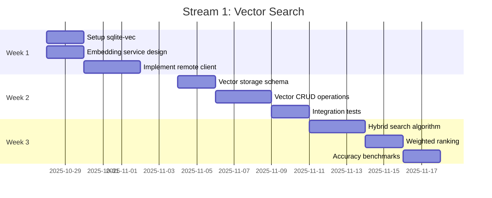
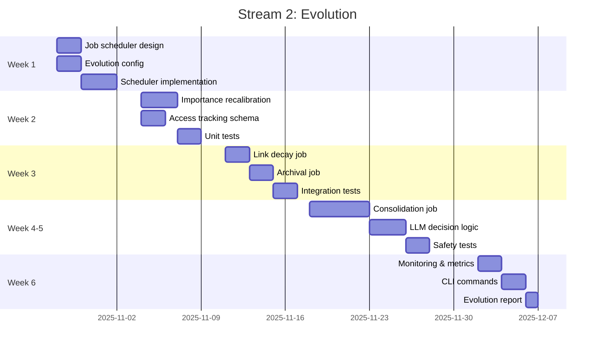
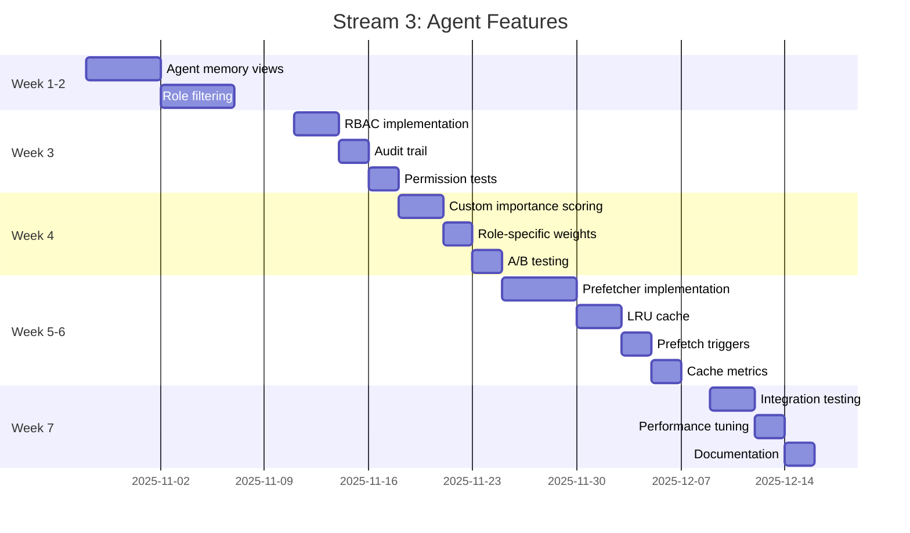

# v2.0 Execution Plan

**Purpose**: Detailed task ordering, parallelization strategy, and checkpoints

**Status**: Phase 3 - Execution Planning

**Timeline**: 12 weeks (3 parallel streams + 1 integration week)

**Date**: 2025-10-27

---

## Table of Contents

1. [Critical Path](#critical-path)
2. [Parallel Work Streams](#parallel-work-streams)
3. [Task Dependencies](#task-dependencies)
4. [Integration Points](#integration-points)
5. [Checkpoints](#checkpoints)
6. [Sub-Agent Spawn Plan](#sub-agent-spawn-plan)
7. [Risk Mitigation](#risk-mitigation)

---

## Critical Path

The critical path determines minimum project duration:

```
Week 1-3: Vector Search (Stream 1)
  → Week 4-6: Evolution Consolidation (Stream 2, blocked by vectors)
    → Week 12: Final Integration & Release

Total: 12 weeks
```

**Critical Path Tasks** (cannot be parallelized):
1. Vector embedding service (Week 1) → Vector storage (Week 2) → Hybrid search (Week 3)
2. Evolution infrastructure (Week 1-2) → Consolidation job (Week 4-5, needs vectors)
3. All streams → Integration testing (Week 12)

**Non-Critical Tasks** (can parallelize):
- Evolution: Importance, Links, Archival (parallel with Vector Search)
- Agent Features: All components (parallel with both)
- Documentation (continuous, parallel with all)

---

## Parallel Work Streams

### Stream 1: Vector Similarity Search
**Lead**: Sub-Agent Alpha
**Duration**: 3 weeks
**Dependencies**: None



**Deliverables**:
- `src/embeddings/remote.rs` + tests
- `src/storage/vectors.rs` + tests
- `src/search/hybrid.rs` + tests
- `migrations/006_vector_search.sql`

---

### Stream 2: Background Memory Evolution
**Lead**: Sub-Agent Beta
**Duration**: 6 weeks
**Dependencies**: Consolidation (Week 4-5) needs Stream 1 complete



**Deliverables**:
- `src/evolution/scheduler.rs` + tests
- `src/evolution/importance.rs` + tests
- `src/evolution/links.rs` + tests
- `src/evolution/archival.rs` + tests
- `src/evolution/consolidation.rs` + tests
- `migrations/007_evolution.sql`

---

### Stream 3: Advanced Agent Features
**Lead**: Sub-Agent Gamma
**Duration**: 7 weeks
**Dependencies**: None (fully independent)



**Deliverables**:
- `src/agents/memory_view.rs` + tests
- `src/agents/access_control.rs` + tests
- `src/agents/importance_scorer.rs` + tests
- `src/agents/prefetcher.rs` + tests
- `src/agents/cache.rs` + tests
- `migrations/008_agent_features.sql`

---

### Stream 4: Documentation & Coordination
**Lead**: Main Agent
**Duration**: 12 weeks (continuous)
**Dependencies**: Reviews all streams

**Continuous Tasks**:
- Week 1-3: Monitor Stream 1 progress, review PRs
- Week 1-6: Monitor Stream 2 progress, review PRs
- Week 1-7: Monitor Stream 3 progress, review PRs
- Week 1-12: Update documentation as features complete
- Week 12: Final integration testing, v2.0.0 release

**Deliverables**:
- Updated ARCHITECTURE.md
- Migration guide (v1.0 → v2.0)
- Performance comparison report
- Updated MCP_SERVER.md
- Release notes

---

## Task Dependencies

### Dependency Graph

```
Stream 1 (Weeks 1-3)
├─ Embedding Service (Week 1)
├─ Vector Storage (Week 2) ─┐
└─ Hybrid Search (Week 3) ──┼─→ Stream 2 Consolidation (Week 4-5)
                             │
Stream 2 (Weeks 1-6)          │
├─ Scheduler (Week 1) ───────┤
├─ Importance (Week 2) ──────┤  (Independent)
├─ Links & Archival (Week 3) ┤
├─ Consolidation (Week 4-5) ←┘  (Blocked until Stream 1 done)
└─ Monitoring (Week 6)

Stream 3 (Weeks 1-7)
├─ Agent Views (Week 1-2)
├─ RBAC (Week 3)
├─ Scoring (Week 4)
└─ Prefetching (Week 5-6)
└─ Integration (Week 7)

Stream 4 (Weeks 1-12)
└─ Continuous documentation and coordination
```

### Dependency Matrix

| Task | Depends On | Can Start | Blocks |
|------|-----------|-----------|--------|
| **Embedding Service** | None | ✅ Week 1 | Hybrid Search |
| **Vector Storage** | None | ✅ Week 1 | Hybrid Search, Consolidation |
| **Hybrid Search** | Embedding + Storage | Week 3 | Consolidation |
| **Evolution Scheduler** | None | ✅ Week 1 | All evolution jobs |
| **Importance Job** | Scheduler | Week 2 | None |
| **Links Job** | Scheduler | Week 2 | None |
| **Archival Job** | Scheduler | Week 2 | None |
| **Consolidation Job** | Scheduler + Vector Storage | Week 4 | None |
| **Agent Views** | None | ✅ Week 1 | RBAC, Scoring |
| **RBAC** | Agent Views | Week 3 | Scoring |
| **Custom Scoring** | RBAC | Week 4 | Prefetching |
| **Prefetching** | Scoring | Week 5 | None |

---

## Integration Points

### Week 3: Stream 1 → Stream 2 Handoff

**Integration Point**: Vector Search complete, Consolidation can start

**Handoff Protocol**:
1. Stream 1 (Alpha) tags commit: `v2-vector-search-complete`
2. Stream 1 creates typed hole validation test
3. Main Agent reviews vector search implementation
4. Main Agent approves handoff
5. Stream 2 (Beta) starts consolidation work (Week 4)

**Validation**:
```rust
// Typed hole #2 validation
#[test]
fn test_vector_storage_interface_complete() {
    // Verify VectorStorage trait fully implemented
    assert_impl_all!(SqliteVectorStorage: VectorStorage);
}
```

---

### Week 7: Stream 3 Complete

**Integration Point**: All agent features ready for orchestration integration

**Handoff Protocol**:
1. Stream 3 (Gamma) tags commit: `v2-agent-features-complete`
2. Stream 3 creates integration test with orchestration engine
3. Main Agent reviews agent features
4. Main Agent integrates with PyO3 orchestration layer

**Validation**:
```python
# Test agent features with orchestration
def test_agent_memory_view_integration():
    executor = ExecutorAgent(memory_view=AgentMemoryView(AgentRole.Executor))
    memories = executor.search("implementation pattern")
    assert len(memories) > 0
    assert all(m.memory_type == MemoryType.Implementation for m in memories)
```

---

### Week 12: Final Integration

**Integration Point**: All streams merge for v2.0.0 release

**Process**:
1. All sub-agents merge to main (via PRs)
2. Run full test suite (unit + integration + e2e)
3. Performance benchmarks vs v1.0 baseline
4. Migration testing (v1.0 → v2.0)
5. Documentation review
6. Release candidate build
7. Final approval
8. Tag v2.0.0

---

## Checkpoints

### Checkpoint 1: Week 3 End
**Date**: 2025-11-18

**Deliverables**:
- ✅ Stream 1: Vector search complete
- ✅ Stream 2: Scheduler + 3 jobs complete (Consolidation not started)
- ✅ Stream 3: Agent views + RBAC complete
- ✅ All unit tests passing
- ✅ Schema migrations 006, 007 (partial), 008 (partial) complete

**Go/No-Go Decision**:
- Vector search accuracy ≥85% → GO
- Vector search latency <200ms → GO
- All typed holes validated → GO
- Otherwise → Address issues before Week 4

---

### Checkpoint 2: Week 6 End
**Date**: 2025-12-09

**Deliverables**:
- ✅ Stream 1: Complete (no changes)
- ✅ Stream 2: All jobs complete including consolidation
- ✅ Stream 3: Custom scoring complete
- ✅ Integration tests passing
- ✅ All schema migrations complete

**Go/No-Go Decision**:
- Evolution jobs run without errors → GO
- Consolidation successfully merges duplicates → GO
- Cache hit rate >50% (target 70% by Week 12) → GO
- Otherwise → Allocate extra week for fixes

---

### Checkpoint 3: Week 11 End
**Date**: 2025-01-13

**Deliverables**:
- ✅ All streams complete
- ✅ Full test suite passing
- ✅ Performance benchmarks complete
- ✅ Documentation updated
- ✅ Migration guide written

**Go/No-Go Decision**:
- All success criteria met → GO to release (Week 12)
- Performance regression detected → Allocate time to optimize
- Critical bugs found → Allocate time to fix
- Otherwise → Delay release

---

## Sub-Agent Spawn Plan

### Sub-Agent Alpha: Vector Search Specialist

**Spawn Time**: Week 1, Day 1

**Context Provided**:
- v2.0 specification (docs/v2/v2.0-specification.md)
- Component decomposition (docs/v2/component-decomposition.md)
- Stream 1 tasks from execution plan
- Typed holes #1, #2, #3
- Test plan for Stream 1

**Prompt**:
```
You are Sub-Agent Alpha, responsible for implementing Vector Similarity Search (Stream 1).

Your tasks:
1. Implement remote embedding service (Voyage AI API)
2. Integrate sqlite-vec extension for vector storage
3. Create hybrid search algorithm with weighted ranking

Timeline: 3 weeks
Success criteria:
- Search accuracy ≥85%
- Latency <200ms p95
- All unit & integration tests passing

Start with Week 1 tasks: sqlite-vec setup and embedding service design.

Report progress daily. Create PR when complete. Tag: v2-vector-search-complete
```

**Handoff Protocol**:
- Daily status updates (async via git commits)
- PR review by Main Agent
- Typed hole validation tests
- Performance benchmarks

---

### Sub-Agent Beta: Evolution Specialist

**Spawn Time**: Week 1, Day 1 (parallel with Alpha)

**Context Provided**:
- v2.0 specification
- Component decomposition
- Stream 2 tasks
- Typed holes #4, #5
- Test plan for Stream 2
- **IMPORTANT**: Consolidation (Week 4-5) blocked until Stream 1 complete

**Prompt**:
```
You are Sub-Agent Beta, responsible for Background Memory Evolution (Stream 2).

Your tasks:
1. Weeks 1-3: Job scheduler + Importance/Links/Archival jobs (independent)
2. Weeks 4-5: Consolidation job (BLOCKED until Vector Search complete)
3. Week 6: Monitoring and CLI

Timeline: 6 weeks
Success criteria:
- Jobs run without errors
- Consolidation reduces duplicates by 30%
- Job runtime <5min for 10K memories

Start with Week 1: Job scheduler design and implementation.

IMPORTANT: Do NOT start consolidation until Alpha tags v2-vector-search-complete.

Report progress daily. Create PR when complete. Tag: v2-evolution-complete
```

**Handoff Protocol**:
- Daily commits
- Coordinator approves start of consolidation (Week 4)
- PR review by Main Agent
- Evolution job reports

---

### Sub-Agent Gamma: Agent Features Specialist

**Spawn Time**: Week 1, Day 1 (parallel with Alpha & Beta)

**Context Provided**:
- v2.0 specification
- Component decomposition
- Stream 3 tasks
- Typed holes #6, #7, #8, #9
- Test plan for Stream 3

**Prompt**:
```
You are Sub-Agent Gamma, responsible for Advanced Agent Features (Stream 3).

Your tasks:
1. Weeks 1-2: Agent memory views with role-based filtering
2. Week 3: Role-based access control and audit trail
3. Week 4: Custom importance scoring per agent role
4. Weeks 5-6: Memory prefetching with LRU cache
5. Week 7: Integration and performance tuning

Timeline: 7 weeks
Success criteria:
- Cache hit rate >70%
- Cached latency <5ms
- Agent-specific search works correctly

Start with Week 1: Agent memory views implementation.

Report progress daily. Create PR when complete. Tag: v2-agent-features-complete
```

**Handoff Protocol**:
- Daily commits
- PR review by Main Agent
- Integration with PyO3 orchestration
- Cache metrics

---

## Risk Mitigation

### Risk 1: Stream 1 Delayed (Vector Search)
**Impact**: Blocks Stream 2 consolidation

**Mitigation**:
- Stream 2 has 3 weeks of independent work (scheduler, importance, links, archival)
- If Vector Search delayed by 1 week, Stream 2 consolidation starts Week 5 instead of Week 4
- Total project延长 extends by 1 week maximum

**Contingency**:
- Main Agent helps Stream 1 if blocked
- Reduce consolidation scope to MVP if needed

---

### Risk 2: Schema Migration Conflicts
**Impact**: Database corruption if migrations clash

**Mitigation**:
- Assign migration numbers upfront (006, 007, 008)
- Main Agent reviews ALL schema changes before merge
- Integration test runs all migrations in sequence
- No migration can modify same table/column

**Contingency**:
- Use ALTER ADD only (never DROP or MODIFY)
- Migrations are idempotent (IF NOT EXISTS)
- Backup database before running migrations

---

### Risk 3: Sub-Agent Becomes Unresponsive
**Impact**: Stream blocked, timeline at risk

**Mitigation**:
- Daily check-ins required
- If no commit for 2 days → Main Agent intervenes
- Clear handoff protocol if sub-agent needs help

**Contingency**:
- Main Agent takes over stream
- Simplify scope to meet timeline
- Request human developer assistance

---

### Risk 4: Performance Regression
**Impact**: v2.0 slower than v1.0

**Mitigation**:
- Performance benchmarks run weekly
- Compare against v1.0 baseline
- Identify regressions early
- Cache and optimize critical paths

**Contingency**:
- Disable problematic feature temporarily
- Allocate extra week for optimization
- Release v2.0.1 with fix

---

## Success Criteria

**Must Have (Week 12)**:
- [ ] All 3 streams complete and merged
- [ ] Search accuracy ≥85%
- [ ] Cache hit rate ≥70%
- [ ] All v1.0 tests still passing
- [ ] No performance regression
- [ ] Migration guide complete
- [ ] All documentation updated

**Nice to Have (can defer to v2.1)**:
- [ ] Local embeddings (fastembed)
- [ ] Advanced prefetch patterns
- [ ] Multi-vector search

---

## Timeline Visualization

```
Week    Stream 1         Stream 2          Stream 3         Stream 4
────────────────────────────────────────────────────────────────────
  1     Embed Service    Scheduler         Agent Views      Review
  2     Vector Storage   Importance        Agent Views      Review
  3     Hybrid Search    Links+Archival    RBAC             Review
  4     Complete ✓       Consolidation     Scoring          Review
  5     ─────────────    Consolidation     Prefetch         Review
  6     ─────────────    Monitoring ✓      Prefetch         Review
  7     ─────────────    ─────────────     Integration ✓    Review
  8     ─────────────    ─────────────     ──────────────   Buffer
  9     ─────────────    ─────────────     ──────────────   Buffer
 10     ─────────────    ─────────────     ──────────────   Buffer
 11     ─────────────    ─────────────     ──────────────   Final Test
 12     Integration → → → → → → → → → → → → → → → → → → v2.0.0 🎉
```

---

**Version**: 1.0
**Status**: Phase 3 Complete - Ready for Phase 4 (Execution)
**Last Updated**: 2025-10-27
