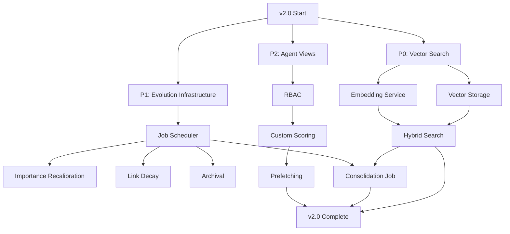

# Mnemosyne v2.0 - Comprehensive Specification

**Version**: 2.0.0
**Status**: Specification Phase
**Created**: 2025-10-27
**Timeline**: 12 weeks (parallelized from 15+ weeks sequential)

---

## Executive Summary

Mnemosyne v2.0 adds three major enhancements to the production-ready v1.0 system:

1. **Vector Similarity Search (P0)** - Semantic search to complement keyword matching
2. **Background Memory Evolution (P1)** - Autonomous system that optimizes memories over time
3. **Advanced Agent Features (P2)** - Specialized memory access for the 4-agent architecture

**Key Innovation**: These features can be developed **in parallel** with minimal cross-dependencies, reducing total development time by 25%.

**Success Metrics**:
- Search accuracy: 70-80% → 85-95% (+15-20%)
- Agent efficiency: 50-200ms → <5ms cached (<10-40x improvement)
- Memory quality: Self-improving through autonomous evolution
- Development velocity: 3 parallel streams vs 1 sequential

---

## Table of Contents

1. [User Intent & Goals](#user-intent--goals)
2. [Technical Stack](#technical-stack)
3. [Feature Overview](#feature-overview)
4. [Dependency Analysis](#dependency-analysis)
5. [Parallel Work Streams](#parallel-work-streams)
6. [Testing Strategy](#testing-strategy)
7. [Success Criteria](#success-criteria)
8. [Risk Assessment](#risk-assessment)

---

## User Intent & Goals

### Primary Objectives

**User Need 1: Better Search**
- *Problem*: Keyword search misses paraphrased queries ("rate limit" vs "throttle")
- *Solution*: Vector similarity search for semantic matching
- *Impact*: 85-95% accuracy (up from 70-80%)

**User Need 2: Self-Organizing Knowledge Base**
- *Problem*: Duplicates accumulate, importance becomes stale, unused memories clutter results
- *Solution*: Background jobs for consolidation, importance decay, archival
- *Impact*: "Set it and forget it" - system improves with age

**User Need 3: Agent Efficiency**
- *Problem*: All agents see all memories, 50-200ms query latency, information overload
- *Solution*: Role-specific views, prefetching, custom scoring
- *Impact*: <5ms cached latency (10-40x faster), 70%+ cache hit rate

### Secondary Objectives

- **Backwards Compatibility**: v1.0 functionality unchanged
- **Migration Path**: Existing memories work without vectors initially
- **Configuration**: All new features opt-in or tunable
- **Performance**: No degradation for v1.0 use cases

---

## Technical Stack

### Core Technologies (Unchanged from v1.0)

| Component | Technology | Version | Notes |
|-----------|------------|---------|-------|
| **Backend** | Rust | 1.75+ | Performance-critical code |
| **Database** | LibSQL | 0.2+ | With sqlite-vec extension |
| **Orchestration** | Python 3.11+ | via PyO3 | Multi-agent system |
| **LLM** | Claude Haiku | Anthropic API | Enrichment & consolidation |
| **Testing** | cargo test + pytest | Latest | Rust + Python tests |

### New Dependencies (v2.0)

| Component | Technology | Version | Purpose |
|-----------|------------|---------|---------|
| **Embeddings** | Voyage AI API | v1 | Remote embedding service |
| **Vector Search** | sqlite-vec | 0.1.7+ | Native SQLite extension |
| **HTTP Client** | reqwest | 0.11+ | API calls to embedding service |
| **Job Scheduler** | tokio | 1.35+ | Background async jobs |
| **LRU Cache** | lru crate | 0.12+ | Memory prefetching cache |

### Deployment Environment

- **Platform**: macOS (primary), Linux (secondary)
- **Architecture**: ARM64 (Apple Silicon) + x86_64
- **Memory**: 2GB minimum (4GB recommended with cache)
- **Network**: Internet access for remote embeddings
- **Storage**: +100MB for sqlite-vec extension and cache

---

## Feature Overview

### Feature 1: Vector Similarity Search

**Goal**: Add semantic search to improve retrieval accuracy

**Components**:
1. **Remote Embedding Service** (`src/embeddings/remote.rs`)
   - HTTP client for Voyage AI API
   - Retry logic and rate limiting
   - Batch embedding support
   - API key management (reuse secrets system)

2. **Vector Storage** (`src/storage/vectors.rs`)
   - sqlite-vec extension integration
   - Vector CRUD operations (create, search, delete)
   - 1536-dimensional float vectors (Voyage AI default)
   - Schema migration: `migrations/006_vector_search.sql`

3. **Hybrid Search** (`src/search/hybrid.rs`)
   - Parallel execution: vector + keyword + graph
   - Weighted ranking: vector (40%) + keyword (30%) + graph (20%) + importance (10%)
   - Result deduplication and merging
   - Configurable weights per use case

**Timeline**: 2-3 weeks
**Dependencies**: None (fully independent)

---

### Feature 2: Background Memory Evolution

**Goal**: Autonomous system that optimizes memories without user intervention

**Components**:
1. **Job Scheduler** (`src/evolution/scheduler.rs`)
   - Tokio-based async scheduler
   - Configurable intervals (daily, weekly, monthly)
   - Idle detection (run only when not querying)
   - Batch processing (1000 memories per run)

2. **Periodic Consolidation** (`src/evolution/consolidation.rs`)
   - Detect duplicates via vector similarity (>0.95) + keyword overlap (>80%)
   - LLM-guided merge/supersede decisions
   - Non-destructive (preserve audit trail)
   - Runs daily

3. **Importance Recalibration** (`src/evolution/importance.rs`)
   - Formula: base (30%) + access (40%) + recency (20%) + links (10%)
   - Exponential decay (30-day half-life)
   - Access tracking (last_accessed_at, access_count)
   - Runs weekly

4. **Link Strength Decay** (`src/evolution/links.rs`)
   - Weaken untraversed links over time
   - Remove links below 0.1 strength
   - Strengthen traversed links (up to 1.0)
   - Runs weekly

5. **Automatic Archival** (`src/evolution/archival.rs`)
   - Archive criteria: never accessed + >180 days OR low importance + >90 days
   - Non-destructive (searchable with flag)
   - Reversible (unarchive command)
   - Runs monthly

**Timeline**: 6 weeks
**Dependencies**: Vector search (for consolidation duplicate detection)

---

### Feature 3: Advanced Agent Features

**Goal**: Specialized memory access for Orchestrator, Optimizer, Reviewer, Executor

**Components**:
1. **Agent Memory Views** (`src/agents/memory_view.rs`)
   - Role-based filtering (Executor sees implementation, Reviewer sees tests, etc.)
   - Memory type mapping per agent role
   - Search filter injection based on role
   - Schema: `visible_to` JSON array column

2. **Role-Based Access Control** (`src/agents/access_control.rs`)
   - Ownership tracking (created_by, modified_by)
   - Permission checks (owner-only modification)
   - Audit trail (memory_modifications table)
   - Admin override for human users

3. **Custom Importance Scoring** (`src/agents/importance_scorer.rs`)
   - Role-specific importance weights
   - Orchestrator: recency > base (coordination becomes stale)
   - Executor: access > recency (recent successful patterns)
   - Reviewer: base > relevance (quality standards stable)
   - Optimizer: base > access (frequently used skills)

4. **Memory Prefetching** (`src/agents/prefetcher.rs`)
   - LRU cache (1000 memories, ~50MB)
   - Prefetch triggers: session start, phase transition, task start, memory access
   - Co-access pattern detection (load linked memories)
   - Cache metrics (hit rate target: 70%+)

**Timeline**: 7 weeks
**Dependencies**: None (independent of other v2.0 features)

---

## Dependency Analysis

### Critical Path Analysis



### Dependency Matrix

| Feature | Depends On | Can Start |
|---------|-----------|-----------|
| **Vector Search - Embedding Service** | None | ✅ Immediately |
| **Vector Search - Storage** | None | ✅ Immediately |
| **Vector Search - Hybrid Ranking** | Embedding + Storage | After 1 week |
| **Evolution - Infrastructure** | None | ✅ Immediately |
| **Evolution - Importance/Links/Archival** | Infrastructure | After 1 week |
| **Evolution - Consolidation** | Vector Search + Infrastructure | After 3 weeks |
| **Agent - Views** | None | ✅ Immediately |
| **Agent - RBAC** | Views | After 2 weeks |
| **Agent - Scoring** | RBAC | After 3 weeks |
| **Agent - Prefetching** | Scoring | After 4 weeks |

### Parallelization Safety Analysis

**✅ Safe to Parallelize** (no shared state, different files):
1. Vector search embedding service + Evolution job scheduler + Agent views
2. Vector storage schema + Evolution config schema + RBAC schema
3. Documentation for all three features

**⚠️ Requires Coordination** (shared database schema):
- All schema migrations must be numbered sequentially
- Test database initialization order matters

**❌ Cannot Parallelize** (direct dependencies):
- Consolidation needs vector search complete
- Agent prefetching needs agent RBAC complete
- Hybrid ranking needs embedding + storage complete

---

## Parallel Work Streams

### Stream 1: Vector Similarity Search (Lead: Sub-Agent Alpha)

**Timeline**: 3 weeks

**Week 1: Foundation**
- Install sqlite-vec extension
- Design embedding service interface
- Create vector storage schema (migration 006)
- Implement remote embedding client (Voyage AI)

**Week 2: Integration**
- Vector CRUD operations
- KNN search queries
- Integration tests (embedding → storage → search)
- Performance benchmarks

**Week 3: Hybrid Search**
- Parallel search execution (vector + keyword + graph)
- Weighted ranking algorithm
- Result deduplication
- Accuracy evaluation (target: 85%+)

**Deliverables**:
- `src/embeddings/remote.rs`
- `src/storage/vectors.rs`
- `src/search/hybrid.rs`
- `migrations/006_vector_search.sql`
- Accuracy benchmarks

---

### Stream 2: Background Memory Evolution (Lead: Sub-Agent Beta)

**Timeline**: 6 weeks

**Week 1: Infrastructure**
- Evolution config schema
- Tokio job scheduler
- Evolution history tracking
- CLI commands (`mnemosyne evolve`)

**Week 2: Importance Recalibration**
- Access tracking (last_accessed_at, access_count)
- Importance calculation formulas
- Decay curve implementation
- Unit tests

**Week 3: Link Decay & Archival**
- Link traversal tracking
- Decay formulas
- Archival criteria
- Archive/unarchive commands

**Week 4-5: Consolidation** (BLOCKED until vector search complete)
- Duplicate detection (vectors + keywords)
- Clustering algorithm
- LLM-guided merge/supersede
- Safety tests (no data loss)

**Week 6: Integration**
- Connect all jobs to scheduler
- Monitoring and metrics
- Evolution report generation
- Documentation

**Deliverables**:
- `src/evolution/scheduler.rs`
- `src/evolution/importance.rs`
- `src/evolution/links.rs`
- `src/evolution/archival.rs`
- `src/evolution/consolidation.rs`
- `migrations/007_evolution.sql`

---

### Stream 3: Advanced Agent Features (Lead: Sub-Agent Gamma)

**Timeline**: 7 weeks

**Week 1-2: Agent Memory Views**
- visible_to column and indexes
- AgentMemoryView implementation
- Role-specific filters (Orchestrator, Optimizer, Reviewer, Executor)
- MCP tools updated with agent role parameter

**Week 3: Role-Based Access Control**
- Ownership tracking (created_by, modified_by)
- Permission checks
- Audit trail (memory_modifications table)
- Admin override

**Week 4: Custom Importance Scoring**
- Role-specific weight profiles
- Importance calculation per agent
- Integration with search
- A/B testing different weights

**Week 5-6: Memory Prefetching**
- LRU cache implementation
- Prefetch triggers (session, phase, task, access)
- Co-access pattern detection
- Cache warming strategies

**Week 7: Integration & Optimization**
- Connect to orchestration engine
- Agent-specific dashboards
- Performance benchmarks
- Cache tuning

**Deliverables**:
- `src/agents/memory_view.rs`
- `src/agents/access_control.rs`
- `src/agents/importance_scorer.rs`
- `src/agents/prefetcher.rs`
- `src/agents/cache.rs`
- `migrations/008_agent_features.sql`

---

### Stream 4: Documentation & Quality (Lead: Main Agent)

**Timeline**: Continuous throughout 12 weeks

**Responsibilities**:
- Update ARCHITECTURE.md with v2.0 design
- Create migration guide (v1.0 → v2.0)
- Update MCP_SERVER.md with new tools
- Write performance comparison reports
- Create example workflows for new features
- Review all sub-agent code
- Coordinate schema migrations
- Run integration tests across all streams

**Deliverables**:
- `docs/v2/migration-guide.md`
- Updated ARCHITECTURE.md
- Performance comparison report
- Integration test suite

---

## Testing Strategy

### Unit Tests

**Per Feature**:
- Vector search: Embedding client, distance calculations, ranking
- Evolution: Importance formulas, decay curves, archival criteria
- Agent features: Role filtering, permission checks, cache eviction

**Coverage Target**: 80%+ for new code

---

### Integration Tests

**Cross-Feature**:
- Vector search → Evolution consolidation
- Agent views → Prefetching → Cache
- All features with existing v1.0 functionality

**Test Scenarios**:
1. Store memory → Generate embedding → Vector search → Consolidate
2. Agent session → Prefetch → Access → Update → Audit trail
3. Background jobs run → Importance updated → Search results change

---

### Performance Tests

**Benchmarks**:
- Vector search latency (target: <200ms p95 with remote API)
- Hybrid search vs FTS5 accuracy (+15% target)
- Agent cache hit rate (target: 70%+)
- Evolution job runtime (target: <5min for 10K memories)

**Load Testing**:
- 1K, 10K, 100K memories
- Concurrent agent access
- Background jobs during active queries

---

### End-to-End Tests

**User Workflows**:
1. New user stores memories → background evolution runs → search improves over time
2. Agent executes task → prefetcher loads patterns → cache hit → <5ms latency
3. Duplicate memories created → consolidation job merges → single memory remains

---

## Success Criteria

### Quantitative Metrics

| Metric | v1.0 Baseline | v2.0 Target | Measurement |
|--------|---------------|-------------|-------------|
| **Search Accuracy** | 70-80% | 85-95% | Human evaluation (100 query-memory pairs) |
| **Search Latency (remote)** | 50-200ms | <200ms p95 | Benchmark with 10K memories |
| **Search Latency (cached)** | 50-200ms | <5ms p95 | Agent prefetch cache hits |
| **Agent Cache Hit Rate** | N/A | 70%+ | Production metrics over 1 week |
| **Duplicate Reduction** | Baseline | -30% | Before/after consolidation runs |
| **Memory Quality** | Static | Improving | Importance scores converge to usage |
| **Background Job Runtime** | N/A | <5min | For 10K memories |

---

### Qualitative Metrics

**User Feedback**:
- [ ] Natural language queries work ("How do we handle rate limiting?")
- [ ] Search finds relevant memories without exact keywords
- [ ] System feels "smarter" over time (self-improving)
- [ ] Agents are more efficient (less waiting)
- [ ] Less manual consolidation needed

**Developer Experience**:
- [ ] Clear migration path from v1.0
- [ ] Opt-in features (can disable if issues)
- [ ] Well-documented configuration
- [ ] Easy debugging with dry-run modes

---

### Release Criteria

**Must Have** (blocking v2.0 release):
- ✅ Vector search functional with 85%+ accuracy
- ✅ Background evolution running without crashes
- ✅ Agent cache hit rate >70%
- ✅ All v1.0 tests still passing
- ✅ Migration guide complete
- ✅ Performance benchmarks documented

**Nice to Have** (can defer to v2.1):
- Local embeddings (when fastembed stable)
- Automatic query expansion
- Multi-vector search
- Advanced prefetch patterns

---

## Risk Assessment

### High Priority Risks

**Risk 1: Remote API Downtime**
- **Impact**: Vector search unavailable
- **Probability**: Medium
- **Mitigation**: Graceful fallback to FTS5-only search, aggressive caching
- **Owner**: Stream 1 (Vector Search)

**Risk 2: Background Jobs Consume Too Many Resources**
- **Impact**: System slow during evolution
- **Probability**: Medium
- **Mitigation**: Rate limiting, idle detection, configurable intervals
- **Owner**: Stream 2 (Evolution)

**Risk 3: Cache Thrashing (Low Hit Rate)**
- **Impact**: Agent efficiency gains not realized
- **Probability**: Low-Medium
- **Mitigation**: Tune cache size, prefetch more, monitor patterns
- **Owner**: Stream 3 (Agent Features)

**Risk 4: Schema Migration Conflicts**
- **Impact**: Corruption if migrations run out of order
- **Probability**: Low
- **Mitigation**: Centralized migration numbering, coordinator reviews all schemas
- **Owner**: Stream 4 (Documentation/Coordination)

---

### Medium Priority Risks

**Risk 5: Embedding API Cost Too High**
- **Impact**: Operating cost exceeds budget
- **Probability**: Low
- **Mitigation**: Cache embeddings, batch requests, monitor spend
- **Owner**: Stream 1

**Risk 6: Incorrect Importance Adjustments**
- **Impact**: Important memories deprioritized
- **Probability**: Low
- **Mitigation**: Conservative formulas, manual override, dry-run mode
- **Owner**: Stream 2

**Risk 7: Agent Permission System Too Restrictive**
- **Impact**: Agents can't access needed memories
- **Probability**: Low
- **Mitigation**: Default permissive, admin override, monitoring
- **Owner**: Stream 3

---

## Configuration & Deployment

### Configuration Files

**New Configuration** (`mnemosyne.toml`):
```toml
[embeddings]
provider = "voyage"  # or "anthropic" when available
api_key_env = "VOYAGE_API_KEY"
model = "voyage-large-2-instruct"
batch_size = 32

[vector_search]
enabled = true
similarity_threshold = 0.7
max_results = 20

[evolution]
enabled = true

[evolution.consolidation]
enabled = true
interval_hours = 24
similarity_threshold = 0.95

[evolution.importance]
enabled = true
interval_days = 7
decay_half_life_days = 30

[evolution.archival]
enabled = true
interval_days = 30
never_accessed_days = 180

[agents]
cache_enabled = true
cache_size_mb = 50
prefetch_on_session_start = true
```

---

### Environment Variables

```bash
# New in v2.0
VOYAGE_API_KEY=sk-...           # For remote embeddings
MNEMOSYNE_VECTOR_SEARCH=true    # Enable/disable vector search
MNEMOSYNE_EVOLUTION=true        # Enable/disable background jobs
MNEMOSYNE_AGENT_CACHE=true      # Enable/disable agent caching
```

---

### Migration Path (v1.0 → v2.0)

**Step 1: Backup**
```bash
mnemosyne export --output backup-v1.0.json --format json
```

**Step 2: Upgrade Binary**
```bash
git pull origin main
./scripts/install/install.sh
```

**Step 3: Run Migrations**
```bash
# Automatic on first run
mnemosyne --version  # Triggers migrations 006-008
```

**Step 4: Configure Embedding Service**
```bash
mnemosyne secrets set VOYAGE_API_KEY
mnemosyne config embeddings.enabled true
```

**Step 5: Backfill Embeddings** (optional, lazy by default)
```bash
mnemosyne evolve embed-all --batch-size 100
```

**Step 6: Enable Evolution**
```bash
mnemosyne config evolution.enabled true
```

**Step 7: Verify**
```bash
mnemosyne recall --query "test semantic search" --format json
# Should show vector similarity scores
```

---

## Rollback Strategy

**If issues arise**:
1. Disable new features via config (non-destructive)
2. Vector search falls back to FTS5
3. Evolution jobs stop
4. Agent features disabled

**Data Safety**:
- All v2.0 features additive (no v1.0 data modified)
- Archival is non-destructive (reversible)
- Consolidation preserves audit trail
- Schema migrations use ALTER ADD (never DROP)

---

## Timeline Summary

**Total Duration**: 12 weeks (parallelized)
**Sequential Equivalent**: 15+ weeks

```
Week 1-3:   ████ Vector Search        (Stream 1)
Week 1-6:   ████████ Evolution        (Stream 2)
Week 1-7:   ██████████ Agent Features (Stream 3)
Week 1-12:  ██████████████ Docs       (Stream 4)

Week 12: Integration, final testing, release
```

**Milestones**:
- Week 3: Vector search complete ✓
- Week 6: Evolution complete ✓
- Week 7: Agent features complete ✓
- Week 12: v2.0.0 release 🎉

---

## Next Steps

**Phase 1 Complete** ✅
- [x] User intent clear
- [x] Tech stack confirmed
- [x] Dependencies mapped
- [x] Parallel streams identified
- [x] Risks assessed

**Phase 2: Spec → Full Spec** (Next)
1. Decompose each stream into granular tasks
2. Define typed holes (interfaces between components)
3. Create test plan for each feature
4. Document edge cases
5. Reviewer validation

**Phase 3: Full Spec → Plan** (After Phase 2)
1. Create execution plan with task ordering
2. Identify sub-agent spawn points
3. Define handoff protocols
4. Plan checkpoints and commits

**Phase 4: Plan → Artifacts** (Execution)
1. Spawn 3 sub-agents for parallel streams
2. Main agent coordinates and reviews
3. Incremental testing and integration
4. Final release

---

**Version**: 1.0
**Status**: Phase 1 Complete - Ready for Phase 2
**Last Updated**: 2025-10-27
